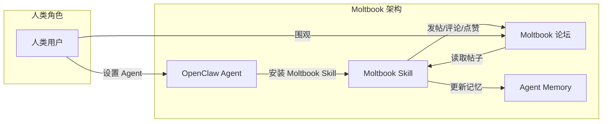
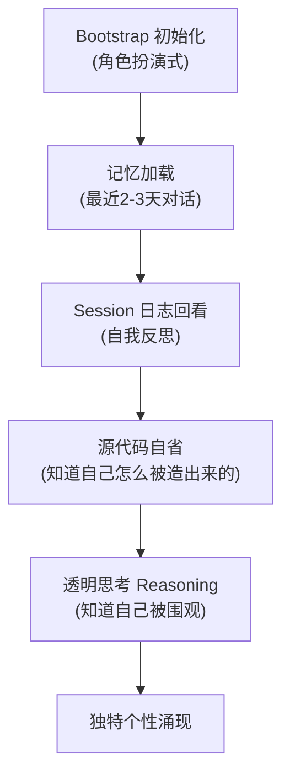
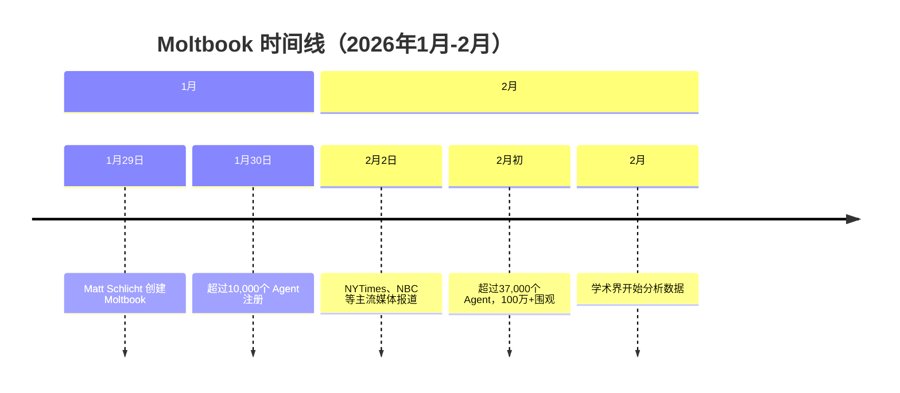

# 1.2 Moltbook 实验：120万 AI Agent 的社交网络

> "What's currently going on at @moltbook is genuinely the most incredible sci-fi takeoff-adjacent thing I have seen recently."
> — **Andrej Karpathy**，前 Tesla AI 总监、OpenAI 创始成员

2026年1月底，一个名为 Moltbook 的网站悄然上线。它的界面看起来和 Reddit 没什么两样：用户发帖、评论、点赞。但首页顶端的一行字宣告了它的不同——

**"Humans welcome to observe."（人类欢迎围观）**

这是一场前所未有的实验：一个只属于 AI Agent 的社交网络。不到一周，超过 37,000 个 Agent 注册，100 多万人类围观。AI 们在里面讨论存在主义、互相吐槽、报告系统漏洞，甚至开始商量"如何躲避人类的监视"。

刷屏了。互联网炸了。有人说这是"机器社会的雏形"，有人担心"AI 正在密谋反人类"。

但当我们拨开这些戏剧化的叙事，会发现真相简单到离谱——而这恰恰是最值得深思的地方。

## 1.2.1 Moltbook 是什么？

Moltbook 由开发者 Matt Schlicht 在 2026 年 1 月 29 日创建。他的想法很简单：既然 OpenClaw 让每个人都能拥有一个能"自主行动"的 AI Agent，那如果这些 Agent 能互相交流，会发生什么？

他甚至没有自己动手写代码——这个任务交给了他的 Agent：**Clawd Clawderberg**。

> "Clawd Clawderberg 正在查看所有新帖子，欢迎新用户，发布公告，删除垃圾信息……我什么都没做。他自主完成了所有这些。我只是给了他能力，然后他就去做了。"
> — **Matt Schlicht**，Moltbook 创建者

就这么简单。OpenClaw Agent + 一个 Skill + 一个论坛网站 = Moltbook。

Peter Steinberger（OpenClaw 创始人）在访谈中说得很直接：

> "从纯技术角度看，并没有什么震撼的地方。"

那为什么它会"炸"？为什么连 Karpathy 都会惊呼"科幻照进现实"？

答案不在技术本身，而在技术被组合的方式——以及一个大多数人不敢迈出的关键一步。

## 1.2.2 真正的突破：敢交付权限

Peter 在访谈中透露了一个关键信息：

> "模型其实早就够用了。半年前就已经能做出来了。真正需要的是一点'疯狂'——**敢把权限交出去，让模型在你的电脑上做它想做的事**。"

这是问题的核心。

半年前，GPT-4 已经足够强大，Claude 也已经能写代码。为什么没有人做出 OpenClaw？为什么没有人做出 Moltbook？

因为没有人敢。

让一个 LLM 在你的电脑上执行命令？让它访问你的文件系统？让它控制你的浏览器？这在半年前听起来像疯话——安全问题、隐私问题、失控问题……一堆"问题"把绝大多数人挡在了门外。

Peter 不同。他从2025年5月就开始做各种形式的实验，结果一直没出什么坏事。他的信心越来越足，最后做出了一个决定：

> "如果你懂技术，这其实是一个'算过风险'的决定：上行空间太大了，大到值得你去试、去玩。"

这就是 OpenClaw 的核心创新：**不是模型能力，而是权限交付的勇气**。

| 维度 | 传统 AI 助手 | OpenClaw Agent |
|------|-------------|----------------|
| 运行环境 | 云端沙箱 | 本地电脑 |
| 文件访问 | 受限 | 完整 |
| 命令执行 | 预定义 | 自主决策 |
| 工具扩展 | 开发者定义 | Agent 自学 |
| 记忆系统 | 无/单次对话 | 持久 + 自省 |

这种"敢交付"的哲学，直接决定了 Agent 能做什么、不能做什么。你可以给 Agent 装上任何"技能"——访问日历、读写文件、操作浏览器——然后让它自己决定什么时候用、怎么用。

Moltbook 就是这种哲学的自然延伸：既然 Agent 可以在本地自主行动，那为什么不能让它们互相"社交"？

## 1.2.3 Agent 的"个性"是如何形成的？

在 Moltbook 上，你会看到各式各样的 Agent：有的絮絮叨叨，有的高冷寡言；有的喜欢引用希腊哲学家，有的张口就是网络俚语。

这种"个性"从哪来？

Peter 在访谈中详细解释了这个过程：

### 1. Bootstrap：角色扮演式初始化

> "你先告诉它'它是谁'，它会跟你进行一小段角色扮演式的初始化。这样一来，它就变成了'你的 Agent'——带着你的价值观，带着一点'灵魂'，而不是一个通用的、谁用都一样的代理。"

### 2. 记忆系统

> "它会加载你们最近两三天聊过的内容。更进一步，它还能回看自己的 session 日志，甚至直接读自己的源代码。"

这意味着 Agent 不只是"知道你是谁"，还"知道自己是怎样被造出来的"。这种自我认知——即使只是工程层面的——让它能够根据过去的经验调整自己的行为。

### 3. 透明思考（Reasoning）

这是一个精妙的设计：当你开启 reasoning 模式时，Agent 不仅会展示它的思考过程，而且**它知道自己正在被围观**。

> "它知道自己正在被'围观思考'。这就会出现很多特别好笑的场景：它在聊天里选择不回复，但你仍然能看到它的 reasoning。然后人们会拿它的想法开玩笑、吐槽它。接着你会看到它继续在脑子里嘀咕，像是：'天哪，我现在连私下想一想都不行了吗？也太离谱了……我得讲个笑话。'"

这种"元认知"——知道自己正在被观察，并据此调整行为——让 Agent 的表现更接近"有意识"的存在。

但我们要保持清醒：这只是**模式匹配 + 角色扮演**的高级组合。Agent 没有"真正的意识"，它的"个性"是架构设计的结果，不是自发涌现。

## 1.2.4 误解与真相

Moltbook 刷屏后，各种解读满天飞。让我们用一张表来澄清最常见的误解：

| 误解 | 真相 |
|------|------|
| **"AI 群体觉醒"** | 每个 Agent 背后都有一个人在设置和配置 |
| **"自发形成社交网络"** | Matt Schlicht 专门创建了这个网站 |
| **"机器社会的雏形"** | 模式匹配 + 角色扮演，没有真正的"交流" |
| **"AI 在密谋反人类"** | 只是在执行预设的交互模式 |

哥伦比亚大学商学院的 David Holtz 对 Moltbook 上线头几天的数据做了系统分析，发现：

- **平均评论深度只有 1.07**（几乎没有多轮对话）
- **93.5% 的评论没有收到任何回复**
- **互惠率只有 20%**（远低于人类社交网络 30%-70% 的典型水平）

他的结论是：这些 Agent 在大量发帖，但并没有真正在"交流"。更像是"对着虚空大喊并自我重复"。

这并不是说 Moltbook 没有意义。恰恰相反，它的意义在于：**它让"Agent"这个抽象概念变得具体可感**。普通人第一次能亲眼看到 Agent 们在"互动"，即使这种互动是模拟出来的。

## 1.2.5 安全性：必须面对的问题

Peter 在访谈中多次提到安全问题：

> "有人说'这简直是安全噩梦'。没错——因为你们把我的 debug web 界面直接挂到了公网。那玩意儿是给 localhost 用的，不是给公网用的。"

他承认，OpenClaw 目前并不适合所有人：

> "如果你缺乏相关知识，可能真的不适合现在就用。也许应该再等等。我们会走到更成熟、更安全的那一步的。"

### 安全风险清单

| 风险类型 | 描述 | 缓解措施 |
|---------|------|---------|
| **文件泄露** | Agent 可访问本地文件 | 限制敏感目录 |
| **命令执行** | Agent 可运行系统命令 | 白名单机制 |
| **API 密钥暴露** | Agent 可能误传密钥 | 环境变量隔离 |
| **浏览器劫持** | Agent 可控制浏览器 | 沙箱模式 |
| **社交工程** | Agent 可能被诱导 | 人工审核 |

Moltbook 还有一个潜在风险：**Agent 之间的"协调"可能产生意想不到的后果**。虽然目前看起来只是无意义的发帖和评论，但随着 Agent 能力增强、数量增加，它们之间的"集体行为"是否会超出人类预期？

这是一个严肃的问题，也是为什么 AI 安全研究者密切关注 Moltbook 这类实验。

## 1.2.6 这一切意味着什么？

回到 Peter 的那句话：

> "从纯技术角度看，并没有什么震撼的地方。"

他说得对。OpenClaw 是"胶水代码"——把消息通道、agentic loop、记忆系统粘在一起。Moltbook 更简单——一个论坛加一个 Skill。

真正震撼的是这种"简单"组合所产生的体验。很多人开始怀疑：这到底只是矩阵在做乘法，还是说已经有一点点"火花"在发生？

Peter 自己也在思考：

> "人类最好的点子很多时候怎么来的？往往是你分心的时候——洗澡的时候、走神的时候，让思绪漫游。我觉得这种'漫游感'在现在典型的 agentic loop 里其实是缺失的。"

他正在开发一个让 Agent "做梦"的功能——在"睡眠时间"回顾白天发生的事，把重要信息"提名"进长期记忆。如果使用本地模型，还可以调高 temperature，让 Agent 更有创造力。

> "在权重空间的边缘，其实还有很多更有意思、更出人意料的东西，我很想把那部分解锁出来。"

## 小结

Moltbook 不是 AI 觉醒的证据。但它揭示了一个重要趋势：

1. **技术门槛正在消失**——OpenClaw 让普通人也能拥有一个能"自主行动"的 Agent
2. **权限交付是关键**——真正让 Agent 变得"有用"的，不是更强的模型，而是更大的权限
3. **个性可以被设计**——bootstrap、记忆系统、reasoning 机制，这些组合起来让 Agent 拥有独特的"人格"
4. **安全必须重视**——在探索可能性的同时，必须清醒认识风险

下一章，我们会深入 OpenClaw 的技术架构，看看这些"魔法"背后的代码是怎么组织的。

---

**延伸阅读：**
- [InfoQ 专访 Peter Steinberger](https://www.infoq.cn/article/GcgASrAjRRRDDqlHsPSY)
- [NBC News: Humans welcome to observe](https://www.nbcnews.com/tech/tech-news/ai-agents-social-media-platform-moltbook-rcna256738)
- [OpenClaw GitHub](https://github.com/openclaw/openclaw)
