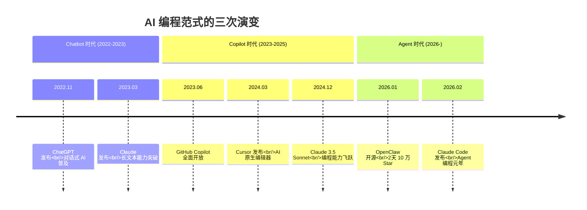
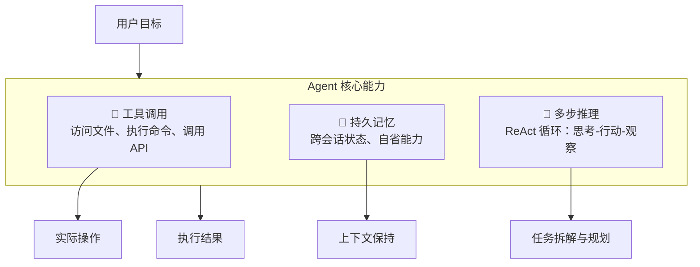
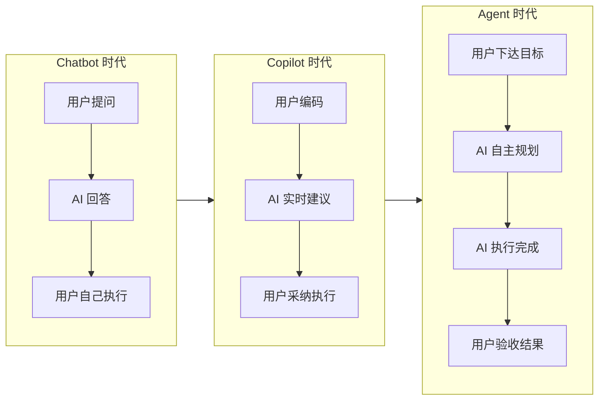

# 1.3 从对话到行动：Agent 的三次范式转变

你有没有发现，这两年跟 AI 的相处方式悄悄变了？

2022 年，我们问 ChatGPT："这段代码什么意思？"
2024 年，我们让 Cursor："帮我补全这个函数。"
2026 年，我们对 OpenClaw 说："把这个需求做了，做好告诉我。"

从问问题，到要建议，到直接派活。AI 从一个"懂很多的朋友"，变成了"能干活的队友"。

这背后，是人机交互的三次范式转变：Chatbot → Copilot → Agent。

## 三次转变的时间线

## 范式一：Chatbot — 被动的知识库

### 核心特征：问答式、被动响应

Chatbot 时代的 AI 像一个博学的图书管理员。你问，它答。不问，它就沉默。

它的能力边界很清晰：
- **能**：回答问题、生成代码片段、解释概念
- **不能**：执行代码、访问文件、记住上次对话

2022 年 11 月，ChatGPT 震撼发布。人们第一次发现，AI 能用自然语言跟你聊编程。但每次对话都是"失忆"的——你问它怎么写一个 API，它给你代码；你说"帮我跑一下"，它说抱歉我做不到。

### 为什么是"Chat"（聊天）？

因为交互方式就是对话。你抛出一个问题，它吐出一个答案。一来一回，像聊天。

这种模式的本质是**知识检索 + 文本生成**。AI 模型读过海量代码，能从中"提取"相关知识，用对话的形式呈现给你。

但它不会"做事"。你让它改个 bug，它只能说"你可以这样改"，然后把修改建议写给你看。真正动手的还是你。

### Chatbot 的历史意义

Chatbot 普及了"大语言模型"这个概念，让普通人第一次感受到 AI 的"智能"。但它停留在**信息层面**——回答问题、提供建议，无法介入**执行层面**。

## 范式二：Copilot — 协作的副驾驶

### 核心特征：实时协作、辅助决策

Copilot 这个词很妙。飞行员（你）在开车，副驾驶（AI）在看地图、提醒路况、偶尔帮你握一下方向盘。

但它不是自动驾驶。你是驾驶员，它是辅助。

### 典型代表：GitHub Copilot 与 Cursor

2023 年，GitHub Copilot 全面开放。你在编辑器里写代码，它在旁边实时补全。你写个函数名，它帮你填函数体；你写个注释，它生成对应的代码。

2024 年，Cursor 把这个模式推向新高度。AI 不只是补全，还能跟你"对话式编程"。你选中一段代码，问它"这里有个 bug"，它会分析问题并给出修改建议。

### Copilot 的关键突破

相比 Chatbot，Copilot 有了**上下文感知**能力。它能看到你当前的文件、项目结构，甚至 Git 历史。这让它给出的建议更贴合你的实际工作。

但它有个本质局限：**被动触发**。你写代码，它补全；你问问题，它回答。你不动，它不动。它不会主动说"我发现你这里有个潜在问题"。

### 数据：Copilot 的三年

根据 Anthropic 的报告，2023-2025 这三年是 Copilot 模式的黄金期。开发者习惯了"AI 辅助"，但驾驶座上始终是人类自己。

一个有趣的统计：2025 年，开发者在 60% 的编程工作中使用 AI，但真正能"完全放手"的任务只有 0-20%。这说明 Copilot 模式下，AI 是强力的辅助工具，但不是独立的执行者。

## 范式三：Agent — 自主的执行者

### 核心特征：自主规划、主动执行

Agent 与 Copilot 的本质区别，可以用一句话概括：

> **Copilot 回答"怎么做"，Agent 直接"做给你看"。**

Agent 不只是建议，它会**规划**、**执行**、**迭代**。你给它一个目标，它自己拆解步骤，调用工具，处理问题，最后给你结果。

### Agent 的三大核心能力

**工具调用**：Agent 能访问你的文件系统、执行命令行、调用外部 API。它不再局限在对话框里，而是能真正"动手"。

**持久记忆**：Agent 有长期记忆。今天你让它改的代码，下周它还记得。它能自我反省，记录学到的东西。

**多步推理**：Agent 采用 ReAct（Reasoning + Acting）模式。它先思考，再行动，观察结果，再调整。像人类解决复杂问题一样。

### 典型案例：乐天（Rakuten）的 7 小时实验

Anthropic 报告中有一个惊人的案例：

> 工程师让 Claude Code 在 vLLM（一个 1250 万行代码的开源库）中实现一种特定的向量提取方法。Claude Code 自主工作了 7 个小时，一次运行就完成了全部工作，数值准确率达到参考方法的 99.9%。

1250 万行代码。7 小时自主运行。99.9% 准确率。

这在一年前是不可想象的。Chatbot 做不到（无法执行），Copilot 做不到（需要人类持续输入）。只有 Agent 能做到。

### 为什么 2026 是 Agent 元年？

技术、产品、商业三方面同时成熟：

**技术成熟**：
- Claude Opus 4、GLM-5 等模型可靠性大幅提升
- 推理成本下降 10-100 倍
- 上下文窗口突破 200K tokens

**产品爆发**：
- OpenClaw：开源两天获得 10 万 Star
- Claude Code：Anthropic 官方推出专业 Agent
- Microsoft Copilot 正在向 Agent 平台转型

**商业落地**：
- Fountain：筛选速度提升 50%，入职速度提升 40%
- TELUS：创建 13000 个定制方案，节省 50 万小时
- Zapier：89% 员工使用 AI，内部部署 800+ Agent

## 三个范式的本质差异

### 对比表格

| 维度 | Chatbot | Copilot | Agent |
|------|---------|---------|-------|
| 交互模式 | 问答式 | 实时协作 | 目标驱动 |
| 触发方式 | 用户提问 | 用户编码 | 用户派活 |
| 工具能力 | 无 | 有限（编辑器内） | 完整（系统级） |
| 记忆系统 | 单次对话 | 无/有限 | 持久化 |
| 执行能力 | 无 | 辅助建议 | 独立完成 |
| 人类角色 | 提问者 | 驾驶员 | 指挥官 |
| 工作周期 | 秒级（回答） | 分钟级（辅助） | 小时到天级（交付） |

### 演进的逻辑线索

把三次转变串起来，是一条清晰的逻辑线：

1. **Chatbot**：能回答问题，但不能做事
2. **Copilot**：能辅助做事，但不能独立完成
3. **Agent**：能独立做事，但需要人类把关

每一步都是在解决上一步的核心缺陷。Agent 不是凭空出现的，它是 Chatbot 和 Copilot 积累的能力，加上"自主执行"这最后一块拼图。

## 这意味着什么？

### 对开发者：从写代码到编排 Agent

以前你的工作流程是：理解需求 → 写代码 → 测试 → 调试 → 发布。

现在变成：定义目标 → 拆解任务 → 派给 Agent → 验收结果。

编码能力依然重要，但更重要的是**系统设计能力**和**任务拆解能力**。你需要想清楚要做什么，怎么验收，而不是自己敲每一行代码。

### 对业务：开发周期从周到天

Anthropic 内部研究有一个发现：工程师报告 AI 节省了时间，但产出量的增加幅度更大。

大约 27% 的 AI 辅助工作，是那些"如果没有 AI 就根本不会做"的事情——扩展项目、做个交互式仪表盘、试探性的实验。

开发周期从周变成天，很多以前觉得"不划算"的项目现在变得可行了。

### 对组织：人人都是"全栈工程师"

Agent 填补了知识空白。一个后端工程师可以用 AI 跨前端工作；一个产品经理可以用 AI 做简单的自动化脚本。

Zapier 的数据很夸张：89% 的员工使用 AI，内部部署了 800 多个 Agent。设计团队用 Claude 在客户访谈中实时生成设计原型——以前需要几周的东西，现在当场就能看到。

"会写代码的人"和"不会写代码的人"之间的界限，正在变模糊。

## 为什么必须学习 Agent 架构？

三次范式转变告诉我们要认清一个事实：

**AI 已经从"工具"进化成了"合作者"。**

工具是被动的，你用一下它动一下。合作者是主动的，你给它目标，它自己想办法完成。

这个转变不是"可能发生"，是"正在发生"。2026 年，所有领先的工程团队都在把 Agent 从"个人工具"变成"组织能力"。

不理解 Agent 架构，你就像 2005 年不理解互联网，2015 年不理解云计算。不是说你一定会被淘汰，但你肯定会错过这一波红利。

后面的章节，我们会深入 OpenClaw 的架构设计，看看一个真正的编程 Agent 是怎么工作的。但现在，你需要记住的只有一点：

> Agent 不是更好的 Copilot，它是全新的物种。

从对话到行动，这个跨越比想象中大得多。
