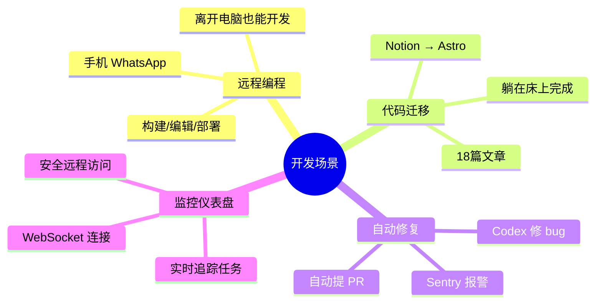
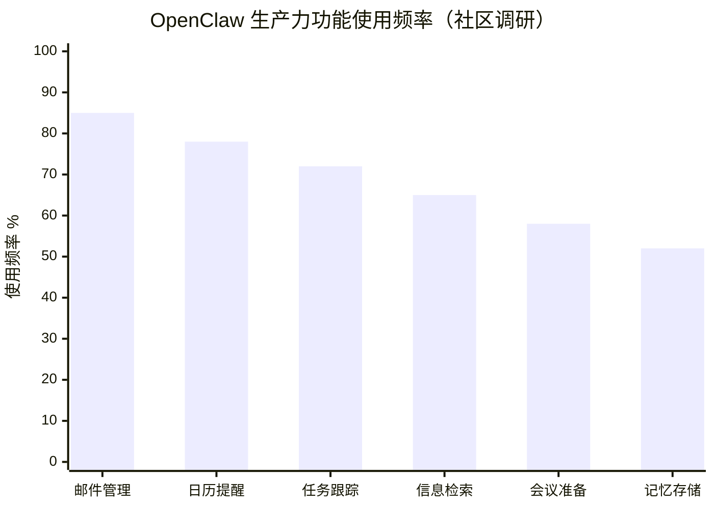
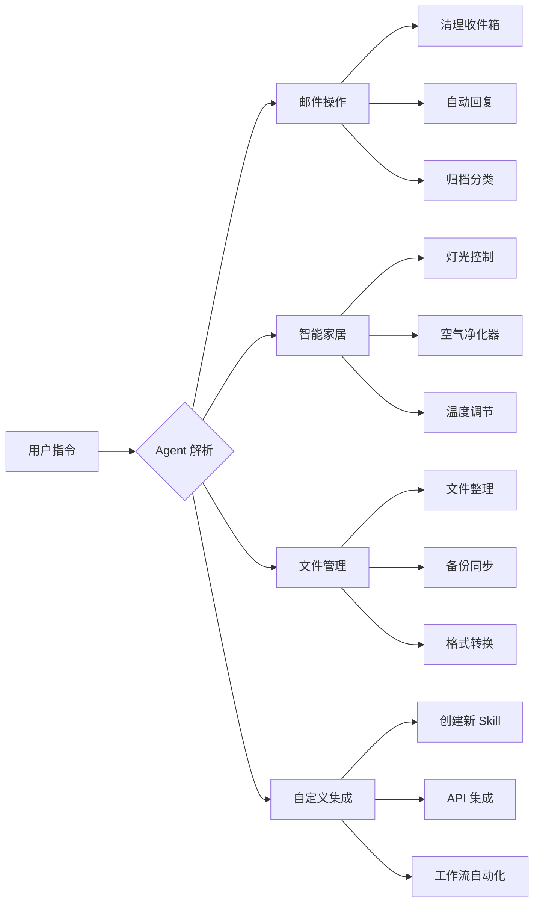
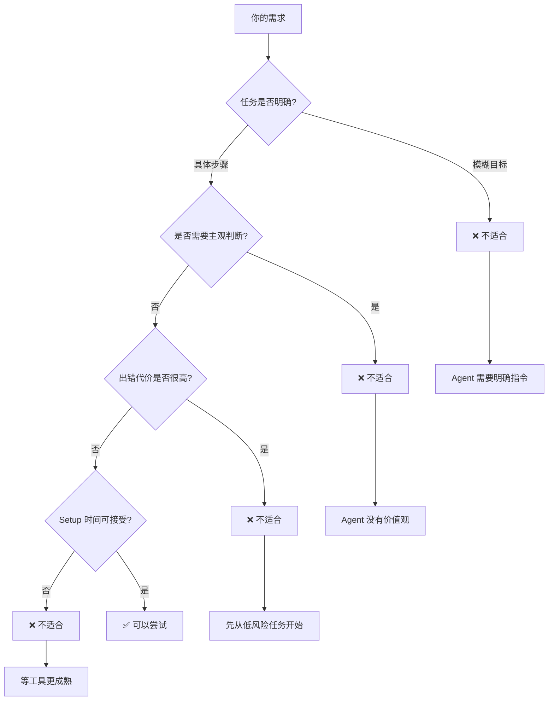

# 1.4 Agent 能做什么？真实案例

"OpenClaw 改变了我的生活。"

"这只是个科学实验，不能依赖。"

同一个工具，两种评价。谁在说实话？

都在。

## 期待 vs 现实

Agent 的能力边界很模糊。有人用它做出了不可思议的自动化。有人折腾一周末发现"根本没法用"。

这不是 Agent 的问题。是期待出了偏差。

这一节不谈理论。只看真实案例——成功的、失败的、都是真的。看完你就能判断：我的需求，适不适合用 Agent？

---

## 开发场景：从代码到部署



### 案例 1：远程编程

> "在手机上通过 WhatsApp 构建编码项目，全部通过聊天完成。"
> — @christinetyip

不是演示视频。是真实工作流。

Christine 的团队要在不同设备间切换。OpenClaw 让她用 WhatsApp 就能执行构建命令、编辑文件、部署到生产环境。

**技术要点**：Skills 系统提供命令执行能力，ReAct 循环让 Agent 能理解"构建项目"这样的自然语言。

**局限**：复杂逻辑判断还是要人。比如"这个 bug 怎么修"，Agent 能执行，但设计方案得你来。

### 案例 2：躺在床上重建网站

> "OpenClaw 更新：昨晚通过 Telegram 重建了整个个人网站，一边看 Netflix 一边躺在床上。Notion → Astro，18篇文章迁移，DNS 转到 Cloudflare。笔记本都没打开。"
> — @davekiss

| 传统方式 | OpenClaw 方式 |
|---------|--------------|
| 打开笔记本 | 拿出手机 |
| 配置 Astro 项目 | 发消息"创建 Astro 项目" |
| 手动复制 18 篇文章 | Agent 自动迁移 |
| 登录 Cloudflare 控制台 | Agent 修改 DNS |

省的不是时间（其实差不多）。省的是注意力——你可以边做其他事边让 Agent 在后台干活。

### 案例 3：自动 Bug 修复流水线

> "这是我们完整的 Sentry → OpenClaw → Codex → PR 工作流，在你听到问题之前就修复 bug，同时在 Slack 通知你。"
> — @nateliason

```
错误发生
    ↓
Sentry 发送报警到 OpenClaw
    ↓
OpenClaw 分析错误信息
    ↓
调用 Codex 生成修复代码
    ↓
自动创建 Pull Request
    ↓
Slack 通知相关人员
```

**技术要点**：网关连接多个服务，Skills 提供 Sentry API、GitHub API、Slack API 的封装。

**局限**：适合简单 bug。涉及架构变更的问题，Agent 搞不定。

### 案例 4：实时监控仪表盘

> "我建了一个实时仪表盘来监控每个 OpenClaw 任务、对话和工作流。"
> — @GanimCorey

有多个 Agent 在跑的时候，监控就重要了。Corey 用 OpenClaw 自己搭了个监控系统：WebSocket 连接做实时更新，Tailscale Serve 做安全远程访问，Token 认证保护数据。

Agent 不只是执行者，也是基础设施的构建者。

---

## 生产力场景：个人助理 2.0



### 案例 5：完美记忆的 AI 助手

> "设置好 OpenClaw 后，我有了一个叫 Claudia 的 AI 助手，她住在 Telegram 里，记得我告诉她的每一件事，而且真的能做事。"
> — @darrwalk

| 功能 | 实现 |
|------|-----|
| 跨聊天记忆 | MEMORY.md + 每日日志 |
| 任务跟踪 | todo list 集成 |
| 上下文保持 | 自动加载相关记忆 |

和普通聊天机器人的区别：你不需要重复说"我之前跟你说过……"，Claudia 会自己去翻记忆库。

### 案例 6：晨间简报 + 会议准备

> "每日日历简报，通过语音在 Basecamp 创建任务，为会议做准备。感觉像一个主动的副驾驶。"
> — @benemredoganer

Heartbeat（心跳）机制的典型应用：

1. 每天早上 Agent 主动检查日历
2. 汇总今天的会议和待办
3. 发送简报到 Telegram
4. 为即将到来的会议准备相关资料

**技术要点**：定时任务 + 数据读取 + 信息聚合。

### 案例 7：24/7 责任伙伴

> "介绍一下 OpenClaw——我的新 AI 助手，在家里的迷你 PC 上 24/7 运行。每日提醒，GitHub 追踪，为我的 2026 目标提供每周问责。"
> — @tobi_bsf

旧电脑变成 24/7 运行的助理：每日提醒喝水、运动、学习，追踪 GitHub 提交频率，每周生成目标进度报告。

价值不在功能多强大。在一直在。人类会忘，机器不会。

### 案例 8：全栈生产力

> "30 分钟后：在 Telegram 上控制 Gmail、日历、WordPress、Hetzner，像个老板。"
> — @Abhay08

```
Telegram
    ├── Gmail（邮件管理）
    ├── Calendar（日程安排）
    ├── WordPress（博客发布）
    └── Hetzner（服务器控制）
```

一个聊天窗口控制多个平台。每个服务对应一个 Skill，Agent 根据意图路由到对应工具。

---

## 自动化场景：生活中的 AI



### 案例 9：邮箱自动化，Inbox 0

> "帮我清理了几百封邮件。Inbox 0。然后设置了一个每周 cron 任务。全部在 WhatsApp 上完成。"
> — @andrewjiang

Inbox 0 不是神话。是规则加执行：Agent 分析邮件内容，根据规则分类（订阅、通知、待办），批量归档/删除，设置定期清理任务。

**技术要点**：邮件 API + 规则引擎 + 定时任务。

### 案例 10：智能家居控制

> "刚拿到 Winix 空气净化器，Claude code 几分钟内就发现并确认控制正常。"
> — @antonplex

没有官方集成？没关系。Agent 自己发现设备、自己测试接口。扫描网络设备，尝试常见 API，验证控制权限。

**局限**：需要设备有 API 接口。纯红外遥控的设备还是搞不定。

### 案例 11：自我创建集成

> "我想从 Todoist 自动化一些任务，OpenClaw 能在 Telegram 聊天里自己创建一个 Skill。"
> — @iamsubhrajyoti

这是 Agent 能力的飞跃：自我扩展。

```
用户："帮我搞定 Todoist 自动化"
Agent："我需要先安装 Todoist 的 Skill……
        没有现成的？那我写一个。"
Agent：[创建 Skill 文件]
Agent：[测试连接]
Agent：[确认功能]
Agent："搞定了，现在可以用了。"
```

Agent 能写代码、能执行代码、能把新能力安装到自己身上。

### 案例 12：完整生活集成

> "我完全迷上 OpenClaw 了。目前集成了邮件（自动归档）、Home Assistant、通过 SSH 控制家庭服务器、待办列表（Things 和 Apple Notes）、购物清单。全部通过一个 Telegram 聊天触达。"
> — @acevail_

| 领域 | 集成 |
|------|-----|
| 通讯 | 邮件自动归档 |
| 智能家居 | Home Assistant |
| 服务器 | SSH 远程控制 |
| 待办 | Things + Apple Notes |
| 生活 | 购物清单 |

一个聊天窗口变成控制中心。价值不在每个功能多强大，在"一个入口"这个体验。

---

## 失败案例：诚实的反思

只说成功案例是骗人。看看失败的声音。

### "周末测试报告"

> "我的 OpenClaw 周末：我试了什么，什么有用，为什么我不玩了。这是个很酷的科学实验，不是能依赖的严肃工作流。"
> — @M_haggis

这位用户花了一整个周末测试，结论是：

**Setup 摩擦大**
- 配置 Skills 比预期复杂
- 各种 API Key 要申请
- 调试问题需要看日志

**不够稳定**
- 同样的指令，有时成功有时失败
- 偶尔出现莫名其妙的错误
- 重启后需要重新配置

**不能依赖**
- 不敢让它处理重要任务
- 出问题不好排查
- 维护成本超过收益

结论：适合玩，不适合工作。

### 这个反馈为什么重要

因为说的是实话。

OpenClaw 今天的状态：
- 能做一些很酷的事
- 但需要你投入时间配置和维护
- 对于偶尔使用的人，Setup 成本可能超过收益

### 什么情况下不适合用 Agent



不适合的场景：

| 场景 | 为什么不适合 |
|------|-------------|
| "帮我规划职业" | 目标太模糊，需要主观判断 |
| "帮我写重要邮件" | 出错代价高，不如自己写 |
| "帮我处理客户投诉" | 需要共情能力，Agent 没有 |
| "偶尔提醒我喝水" | Setup 时间比收益还长 |

适合的场景：

| 场景 | 为什么适合 |
|------|----------|
| 每周清理邮件 | 重复任务，规则明确 |
| 代码迁移 | 大量重复操作 |
| 监控报警 | 7x24 需要响应 |
| 日常提醒 | 一劳永逸 |

---

## 如何判断你的需求

### 适合用 Agent

- ✅ 任务可拆解成具体步骤
- ✅ 有明确的完成标准
- ✅ 出错了可以重来
- ✅ 需要频繁重复
- ✅ 你愿意投入 Setup 时间

### 不适合用 Agent

- ❌ 目标模糊，"看着办"
- ❌ 需要主观判断或审美
- ❌ 出错了代价很高
- ❌ 只用一次
- ❌ 你不想折腾配置

### 决策流程

问自己三个问题：

1. **我能把这个任务写成 SOP 吗？** 能 → 继续；不能 → 不适合
2. **这个任务出错会怎样？** 可以重来 → 继续；不可接受 → 不适合
3. **Setup 的时间值得吗？** 任务会重复很多次 → 值得；只做一两次 → 不值得

---

## 期待值管理：工具 vs 魔法

Agent 不是魔法。是工具。

### Agent 不能做什么

- 不能读懂你的心思
- 不能替代你的判断
- 不能处理"看着办"的任务
- 不能在没有明确指令时"自己想办法"

### Agent 能做什么

- 执行你定义好的流程
- 重复同样的任务不厌其烦
- 7x24 保持运行
- 跨平台整合操作

### 正确的心态

```
错误期待：Agent 会自己想办法把事做好
正确期待：Agent 会按你定义的流程把事做完

错误期待：设置一次，永远运行
正确期待：需要持续维护和调试

错误期待：出问题问 Agent
正确期待：出问题查日志
```

---

## 下一步

看到这里觉得"这些我也能用"？那 OpenClaw 值得你投入时间。下一章会深入 OpenClaw 的架构，看看这些能力是怎么实现的。

觉得"Setup 太麻烦了"？也没问题。等技术更成熟，工具更友好，再考虑也不迟。

Agent 的价值不是让所有人用，是让需要它的人能用。

---

## 案例来源

本文所有案例均来自 OpenClaw Showcase 和真实用户推文：

| 案例编号 | 来源 |
|---------|------|
| 远程编程 | @christinetyip |
| 重建网站 | @davekiss |
| 自动修复 | @nateliason |
| 监控仪表盘 | @GanimCorey |
| AI 助手 Claudia | @darrwalk |
| 晨间简报 | @benemredoganer |
| 责任伙伴 | @tobi_bsf |
| 全栈生产力 | @Abhay08 |
| 邮箱自动化 | @andrewjiang |
| 智能家居 | @antonplex |
| 自我创建集成 | @iamsubhrajyoti |
| 完整生活集成 | @acevail_ |
| 周末测试报告 | @M_haggis |
