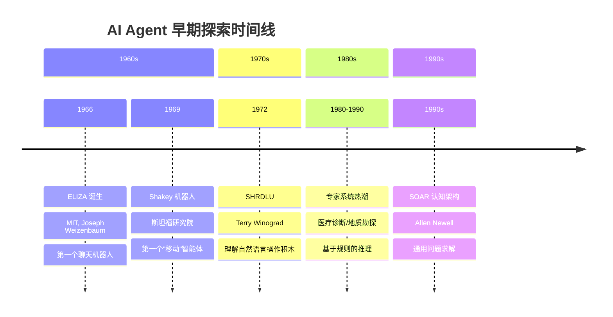
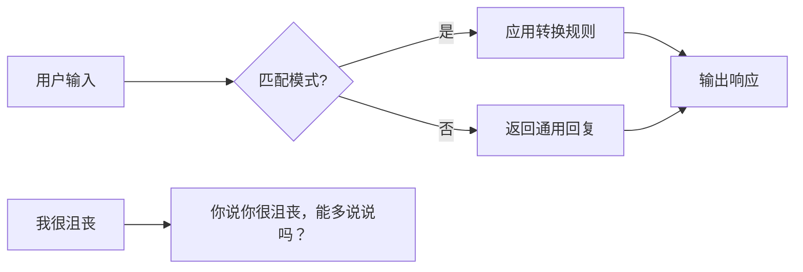
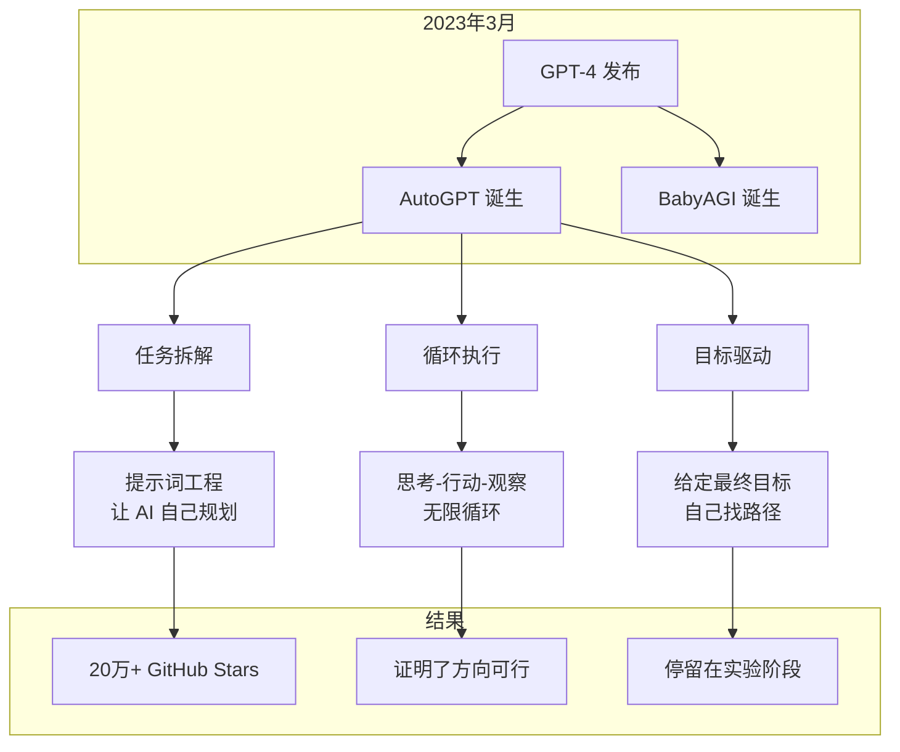
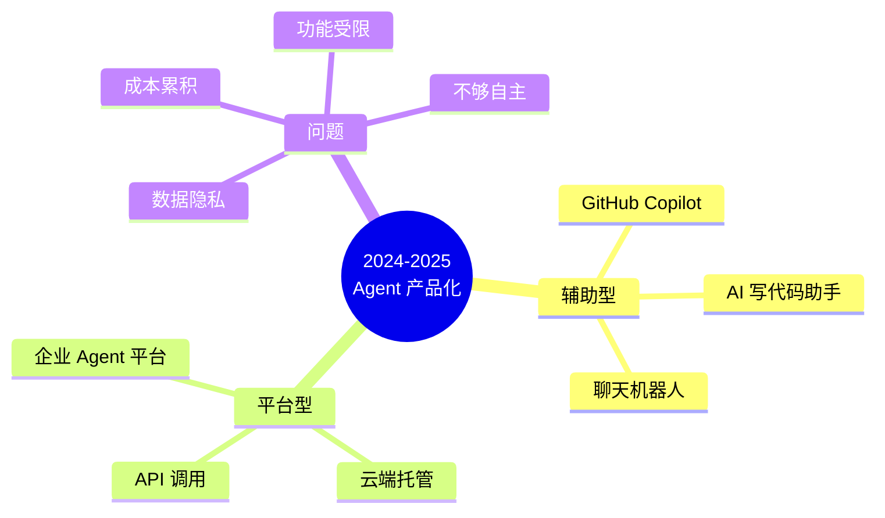
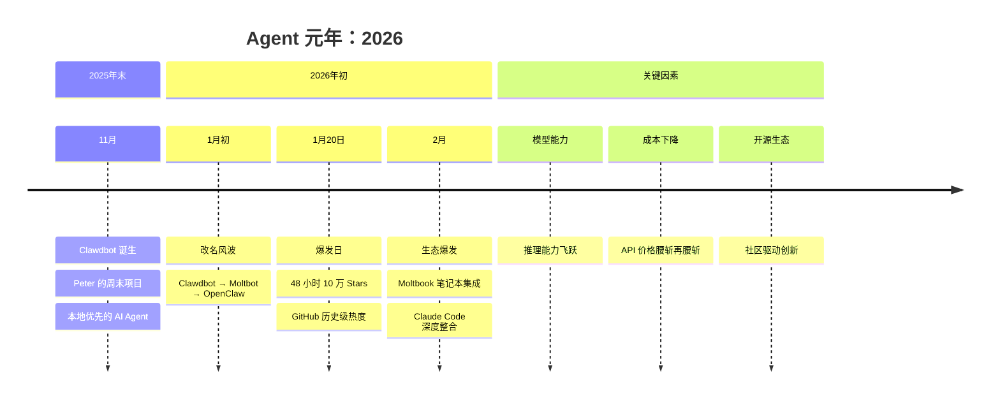
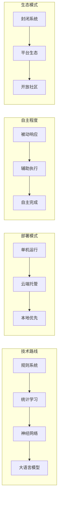

# 1.6 AI Agent 简史：从 ELIZA 到 OpenClaw

1966 年，MIT 的 Joseph Weizenbaum 创造了一个叫 ELIZA 的程序。

它装作心理治疗师。你说"我今天很沮丧"，它回"你说你今天很沮丧，能多说说吗？"看起来像在理解你，实际上就是字符串替换。"我很 X" → "你说你很 X，能多说说吗？"

Weizenbaum 自己被吓到了。他的秘书——一个看着代码写出来的人——竟然对着机器倾诉。1976 年他写了《Computer Power and Human Reason》，警告人类别高估计算机的"判断力"。

57 年后，OpenClaw 在 48 小时内拿下 10 万 GitHub Stars。Agent 终于从实验室走到了每个人的桌面。

为什么用了 60 年？

---

## 早期探索：规则的时代（1960s-1990s）

### ELIZA：第一个"聊天 Agent"

ELIZA 的原理简单得离谱：

200 行代码出头。没有理解，没有推理，没有学习。纯字符串替换。

但它让人们相信机器"懂"自己。Weizenbaum 把这叫 **ELIZA 效应**——人类总觉得计算机的输出是有意义、有意图的交流。

> "我原先只是想展示，通过极其简单的手段，就能让机器产生'理解'的幻觉。没想到人们真的相信它理解了。" —— Joseph Weizenbaum

### 专家系统：规则的天花板

1980 年代，AI 的希望全押在"专家系统"上。

思路挺直白：把专家的知识写成规则。"如果发烧超过 38°C 且咳嗽，则可能是肺炎"。

问题来了：

- **知识获取瓶颈**：专家自己也说不清怎么判断的
- **脆弱性**：遇到规则外的情况，系统直接崩溃
- **维护成本**：一条新规则可能和旧规则打架

典型的专家系统有 3000-10000 条规则。再多？人管不了，机跑不动。

1990 年代初，专家系统热退潮。AI 进了第一个"冬天"。

这个阶段的本质：用人写的规则，模拟人智能。上限在于——人能写出的规则，永远追不上世界的复杂度。

---

## 概念验证：理论上可行（2020-2023）

### 2023 年 3 月：疯狂的 31 天

3 月 14 日，GPT-4 发布。两周后，AutoGPT 出来了。

它干了件没见过的事：让 AI 自己拆任务、自己跑、自己评估。

你说"帮我调研电动汽车市场"。

它就会：
1. 拆成子任务（搜索、整理、分析）
2. 一个个执行（调搜索、写笔记）
3. 评估结果（还缺啥？继续）
4. 循环到"完成"

20 万人点了 Star。这是 AI 历史上最炸的开源项目之一。

但它卡在"实验"。

### 为什么没变成产品？

| 问题 | 表现 | 根子在哪 |
|------|------|----------|
| 成本失控 | 一个任务烧掉 $50 API 费 | 无限循环，没成本意识 |
| 结果随机 | 同样的任务，每次天差地别 | 模型不够稳 |
| 无法调试 | 出错不知道在哪一步 | 缺可观测性 |
| 效率极低 | 简单任务跑 30 分钟 | 串行执行，没优化 |

AutoGPT 证明了：让 AI 自己规划执行，理论上行得通。

但 2023 年的模型——还不够强。

---

## 产品化探索：从玩具到工具（2024-2025）

2024 年，Agent 开始从"实验"往"产品"走。

### 两条路

**路径一：AI 辅助（Copilot 模式）**

GitHub Copilot、Cursor、各种 AI 写作助手。人主导，AI 辅助。

有用，但不是真正的 Agent。Agent 的定义是"自主完成目标"。Copilot 没有"自主"。

**路径二：企业平台（云端托管）**

各种"AI Agent 平台"冒出来。企业把数据传到云端，平台帮你跑。

有用，但问题一堆：

- **数据隐私**：你的商业机密，传到别人的服务器？
- **成本累积**：按调用收费，一个月下来够买台服务器
- **功能受限**：只能用平台允许的工具

### 这个阶段的共识

2024-2025 年，AI 圈形成了一个共识：

> Agent 是未来，但现在的技术还不够成熟。

GitHub Copilot 负责人说："真正的自主 Agent，至少还要 3-5 年。"

他错了。只要 1 年。

---

## Agent 元年：技术成熟（2026）

### 为什么是 2026？

三件事同时成熟了。

**1. 模型能力突破**

2023 年的 GPT-4，推理能力勉强够用。2025 年的新模型，复杂任务成功率从 30% 蹿到 80%。

差在哪？**多步推理**。Agent 的核心就是拆任务、逐步执行。模型推理不够，Agent 就是瞎折腾。

**2. 成本断崖式下跌**

| 时间 | GPT-4 级别调用成本 |
|------|-------------------|
| 2023 年 3 月 | $0.06 / 1K tokens |
| 2024 年 6 月 | $0.03 / 1K tokens |
| 2025 年 12 月 | $0.005 / 1K tokens |

成本砍了 10 倍不止。Agent 不再是"烧钱玩具"，而是"日常工具"。

**3. 开源生态爆发**

Ollama、llama.cpp、各种开源模型。你自己电脑上就能跑个不错的 Agent，一分 API 费不用掏。

本地优先成了现实。数据隐私问题？不存在的，数据从没离开过你的机器。

### OpenClaw：60 年的答案

2025 年 11 月，一个叫 Peter 的程序员周末写了个小工具。

他想让 AI 帮自己管项目——读代码、写文档、提 PR。GitHub Copilot 做不到，云端平台太贵。干脆自己写一个。

起名 Clawdbot。后来改 Moltbot，最后定 OpenClaw。

2026 年 1 月 20 日，OpenClaw 登上 GitHub Trending。48 小时，10 万人点了 Star。

为什么？

因为它把三个问题全解决了：

| 问题 | 以前的方案 | OpenClaw 的解法 |
|------|-----------|----------------|
| 成本 | 云端 API，按次收费 | 本地优先，开源免费 |
| 隐私 | 数据上传到服务器 | 数据从不出本地 |
| 自主 | Copilot 只能辅助 | 真正自主完成任务 |

1966 年以来，Agent 第一次变成"普通人可用的日常工具"。

---

## 演进规律：60 年教会我们的事

### 规律一：从规则到学习

ELIZA 靠人写规则。专家系统靠人写规则。有多少规则，就有多少能力。

GPT 不需要人写规则。它从海量数据中"学会"了语言。

Agent 也一样。AutoGPT 靠提示词规则；OpenClaw 靠模型能力。前者死板，后者灵活。

规则越少，能力越强。

### 规律二：从云端到本地

2023-2024 年，所有 Agent 都在云端跑。为什么？模型太大，本地带不动。

2025 年，开源小模型追平 GPT-3.5。2026 年，笔记本能跑 GPT-4 级别的模型。

云端的优势（算力）被本地的优势（隐私、成本）抵消了。本地优先，云端可选。

### 规律三：从辅助到自主

Copilot 要人不断输入。Agent 自己完成。

这不只是效率提升，是**范式转变**：

- 辅助模式：人 + AI = 1.5 倍效率
- 自主模式：人 → AI = AI 独立完成

AI 从工具变成队友。

### 规律四：从封闭到开放

专家系统封闭——规则写死，没法扩展。

AutoGPT 半开放——能加工具，但生态薄。

OpenClaw 完全开放——社区贡献工具、模板、最佳实践。

生态开放度决定天花板。

---

## 结语：下一个 60 年

1966 年，Weizenbaum 创造 ELIZA 时，担心人们过度信任机器。

2026 年，OpenClaw 让 Agent 走进千家万户。Weizenbaum 的担忧依然有价值——我们仍需警惕对 AI 的盲目信任。

但有一点不同了：60 年后的 Agent，真的能帮我们做事了。不只是模式匹配，不只是规则推理，而是真正的理解、规划、执行。

从 ELIZA 到 OpenClaw，不是线性进步。是无数次尝试、失败、重来，最终在技术、成本、生态同时成熟的时刻，迎来爆发。

下一个 60 年会怎样？

我不知道。但我知道，最好的方法是参与其中。

---

*下一章，我们深入 OpenClaw 的核心设计——为什么它能在本地运行，以及如何做到真正的自主。*
