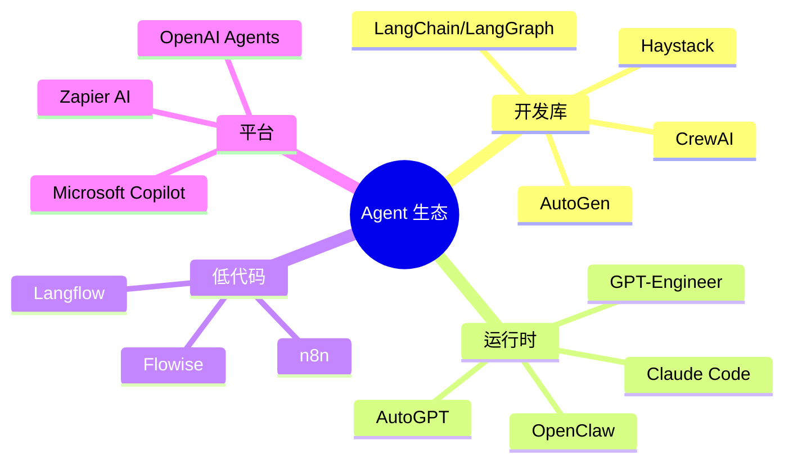
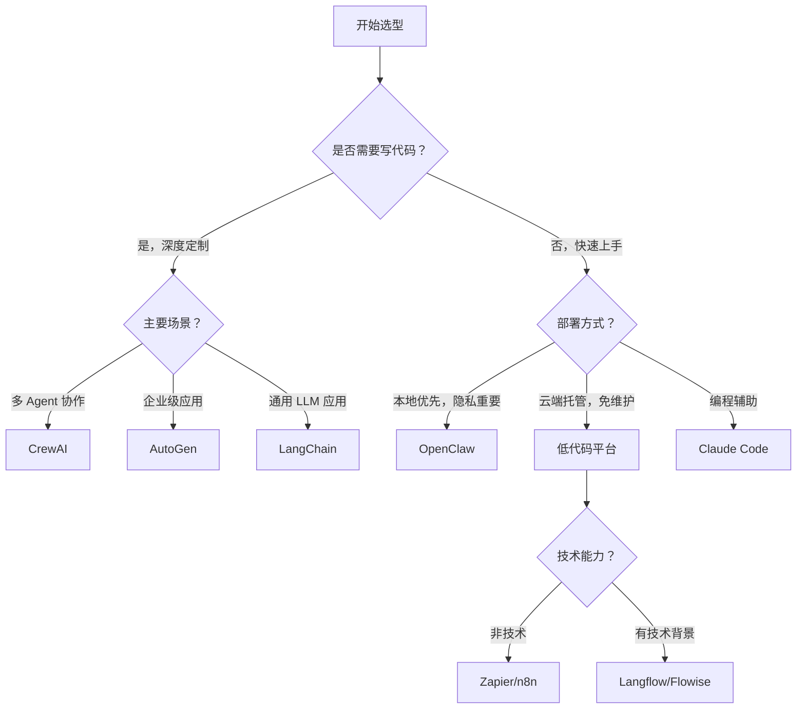
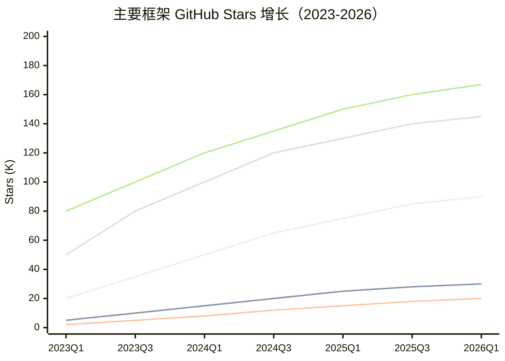

# 1.7 Agent 生态全景

> "选框架跟找对象差不多——没有最好的，只有最顺眼的。"

## 1.7.1 生态爆发：2026 年的 Agent 世界

2023 年那会儿，你要是问"有哪些 Agent 框架"，掰着手指头就能数过来。到了 2026 年，这个问题得用表格回答了。

怎么一下子冒出来这么多？说白了，Agent 开发确实麻烦——调模型、接工具、管记忆、搞多 Agent 协作……每家框架都在用自己的路子解决这些痛点。有的主打灵活，有的追求简单上手，有的冲着企业客户去。

别觉得这是"重复造轮子"，更准确的说法是：不同场景需要不同的工具。

### 生态全景图

## 1.7.2 三大分类：先想清楚你要啥

聊具体框架之前，得先搞明白 Agent 工具分哪几类。这就像买车——你得先想好要跑车、SUV 还是皮卡。

### 开发库（Libraries）

**特点**：得写代码，但灵活性拉满

开发库给你的是"积木"，怎么搭全看你自己。适合以下情况：
- Agent 行为需要深度定制
- 手头有技术团队和成熟的开发流程
- Agent 是产品的核心功能

**代表**：LangChain、CrewAI、AutoGen

### 运行时（Runtimes）

**特点**：开箱即用，配置为主

运行时相当于"成品 Agent"，你负责配置和扩展就行。适合：
- 想快速验证个想法
- 个人用或者小团队用
- 不想写太多代码

**代表**：OpenClaw、Claude Code、AutoGPT

### 低代码/平台（Low-Code/Platforms）

**特点**：可视化操作，托管在云端

低代码平台让不会写代码的人也能搭 Agent 工作流。适合：
- 业务人员主导的自动化需求
- 快速出原型或做内部工具
- 不需要太深的定制

**代表**：Langflow、n8n、Zapier AI

### 分类对比

| 维度 | 开发库 | 运行时 | 低代码/平台 |
|------|--------|--------|-------------|
| 技术门槛 | 高（得会写代码） | 中（主要是配置） | 低（可视化） |
| 灵活性 | 最高 | 中等 | 较低 |
| 上手速度 | 慢 | 快 | 最快 |
| 定制能力 | 完全可控 | 扩展点有限 | 模板化 |
| 部署方式 | 自己搞 | 本地或云 | 云端 |
| 典型用户 | 开发者 | 技术用户/个人 | 业务人员 |

## 1.7.3 主要玩家速览

来看看生态里都有哪些"狠角色"。

### LangChain / LangGraph：生态之王

⭐ 90K+ Stars | 🔧 Python/JS/TS

**定位**：LLM 应用界的"操作系统"

LangChain 不是单一产品，是一整套工具链：
- **LangChain Core**：基础抽象层
- **LangGraph**：多 Agent 状态机编排
- **LangSmith**：调试和监控平台
- **LangServe**：部署服务

**优势**：
- 生态最完整，社区最活跃
- 新模型、新工具基本都会优先支持
- 文档多，教程到处都是

**劣势**：
- 学习曲线陡，抽象层次有点多
- 版本迭代快，API 说变就变
- 简单需求用它有点"杀鸡用牛刀"

**适合谁**：要构建复杂 LLM 应用的团队，愿意花时间学习换来长期灵活性。

### CrewAI：协作专家

⭐ 20K+ Stars | 🔧 Python

**定位**：让多个 Agent 像团队一样干活

CrewAI 的核心思路是"角色扮演"——每个 Agent 有自己的角色、目标和背景故事。定义好 Task 和 Crew，Agents 就能协作完成任务。

**优势**：
- 多 Agent 协作模式直观好懂
- 支持人类介入（Human-in-the-loop）
- 内置多种协作模式（顺序执行、层级管理）

**劣势**：
- 生态规模比不上 LangChain
- 对 OpenAI API 依赖较重（虽然也支持其他模型）
- 调试复杂的协作流程有点头疼

**适合谁**：需要多个专业 Agent 配合的场景，比如研究团队、内容生产、自动化工作流。

### AutoGen：企业之选

⭐ 30K+ Stars | 🔧 Python | 🏢 Microsoft

**定位**：微软出品的企业级多 Agent 框架

AutoGen 强调"对话流"（Conversation Flow），Agents 通过对话来解决问题。支持复杂的对话模式和人类反馈。

**优势**：
- 微软生态集成（Azure、Office）
- 对话流控制强大
- 适合构建企业级应用

**劣势**：
- 学习曲线不友好
- 不用 Azure 的话，部分优势享受不到
- 社区规模比 LangChain 小

**适合谁**：微软技术栈的企业用户，要搭建内部 Agent 系统的。

### OpenClaw：个人之友

⭐ 145K+ Stars | 🔧 Node.js/TypeScript

**定位**：本地优先的个人 AI Agent

OpenClaw 的设计哲学是"你的 AI，你的设备，你的数据"。它是一个完整的 Agent 运行时，不需要依赖云端。

**优势**：
- 本地运行，数据不出设备
- Skills 生态丰富
- 支持多平台（Telegram、Discord 等）
- 开箱即用，配置简单

**劣势**：
- 运行环境得自己管
- 企业级功能相对少
- 主要面向个人和小团队

**适合谁**：注重隐私的个人用户，想要一个"一直在线"的 AI 助手。

### Claude Code：官方出品

🏢 Anthropic | 🔧 CLI

**定位**：Anthropic 官方的 AI 编程助手

Claude Code 是 Claude 模型官方的 CLI 工具，专注编程辅助。深度集成 Claude 的能力，适合开发者日常使用。

**优势**：
- 官方支持，跟 Claude 模型深度集成
- 编程场景优化到位
- 持续更新

**劣势**：
- 功能范围相对专注（主要是编程）
- 需要有 Claude API 访问权限
- 不是开源的

**适合谁**：Claude 用户，日常工作以编程为主的开发者。

### 框架对比一览

| 框架 | Stars | 类型 | 主要语言 | 学习曲线 | 最佳场景 |
|------|-------|------|----------|----------|----------|
| LangChain | 90K | 开发库 | Python/JS | 陡峭 | 复杂 LLM 应用 |
| CrewAI | 20K | 开发库 | Python | 中等 | 多 Agent 协作 |
| AutoGen | 30K | 开发库 | Python | 陡峭 | 企业应用 |
| OpenClaw | 145K | 运行时 | Node.js | 平缓 | 个人助手 |
| Claude Code | - | 运行时 | CLI | 平缓 | 编程辅助 |
| AutoGPT | 167K | 运行时 | Python | 中等 | 自主任务 |

## 1.7.4 如何选择：决策指南

选择这么多，怎么选？给你一个简化的决策树：

### 选型决策树

### 关键问题清单

做决定之前，先问问自己这些问题：

1. **谁在用？**
   - 个人用 → 运行时（OpenClaw、Claude Code）
   - 团队开发 → 开发库（LangChain、CrewAI）
   - 业务人员 → 低代码平台

2. **做什么？**
   - 编程辅助 → Claude Code
   - 多 Agent 协作 → CrewAI、AutoGen
   - 通用 Agent 应用 → LangChain
   - 个人 AI 助手 → OpenClaw

3. **时间紧不紧？**
   - 今天就要用 → 运行时/低代码
   - 可以花时间学 → 开发库

4. **隐私要求高不高？**
   - 数据不能出设备 → OpenClaw（本地运行）
   - 云服务也能接受 → 任何框架都行

5. **预算怎么样？**
   - 尽量免费 → 开源框架
   - 可以付费 → 平台服务（省运维成本）

### 典型场景匹配

| 场景 | 推荐框架 | 理由 |
|------|----------|------|
| 个人 AI 助手 | OpenClaw | 本地运行，隐私友好，开箱即用 |
| 编程效率提升 | Claude Code | 官方深度集成，编程场景优化 |
| 构建 AI 产品 | LangChain | 生态完整，灵活可控 |
| 研究自动化 | CrewAI | 多 Agent 协作，角色分工明确 |
| 企业内部工具 | AutoGen | 微软生态，企业级支持 |
| 快速原型验证 | Langflow | 可视化，不用写代码 |

## 1.7.5 未来趋势：生态往哪走？

Agent 生态还在快速变化。这几个趋势值得关注：

### 1. Agentic Mesh：框架互操作

以后的 Agent 不会"绑死"在一个框架上。就像今天的微服务，不同框架构建的 Agent 需要互相通信、协作。

**标准化协议**正在冒头：
- **MCP (Model Context Protocol)**：Anthropic 推的工具调用标准
- **Skills**：OpenClaw 的技能标准化方案
- **OpenAI Functions**：OpenAI 的函数调用格式

有了这些标准，不同框架的 Agent 就能"说同一种语言"了。

### 2. 模块化生态

"全栈框架"正在让位给"模块化组件"：
- 选你喜欢的大模型接口
- 选你需要的记忆系统
- 选你想要的工具集成

以后的选择不再是"A 框架还是 B 框架"，而是"A 的编排 + B 的记忆 + C 的工具"。

### 3. 本地化与隐私

随着模型能力下沉（小模型越来越强），本地跑 Agent 变得越来越可行。用户对数据隐私的关注也在推这个趋势。

OpenClaw 这种本地优先的方案，估计会获得更多关注。

### 4. 从通用到垂直

通用的"万能 Agent"正在让位给垂直领域的专业 Agent：
- 编程 Agent（Claude Code、Cursor）
- 研究 Agent（Perplexity）
- 写作 Agent（Jasper）
- 数据分析 Agent

### Stars 增长趋势

*注：上图分别是 LangChain、AutoGen、CrewAI、OpenClaw、AutoGPT 的增长趋势示意*

## 1.7.6 小结：没有银弹，只有取舍

读完这一节，你可能发现没有"最好的框架"——这正是重点。

选 Agent 框架就像选编程语言：
- JavaScript 适合 Web，但搞不了系统编程
- Python 适合 AI/ML，但性能比不过 Rust
- 每个选择都有代价

**记住这几条**：

1. **先想清楚需求，再看框架** —— 别因为某个框架火就去用它
2. **从小处着手** —— 先用最简单的方案验证想法
3. **考虑长期维护** —— 今天的选择会变成明天的成本
4. **保持开放心态** —— 生态在变，你的选择也可以变

> 💡 **实践建议**：如果你是个人用户，想快速体验 Agent 能力，从 OpenClaw 或 Claude Code 入手。如果你是开发者，想构建 Agent 产品，从 LangChain 的教程开始，边学边做。

---

*下一章，我们聊聊 Agent 的核心技术：记忆系统是怎么让 AI "记住"一切的。*
