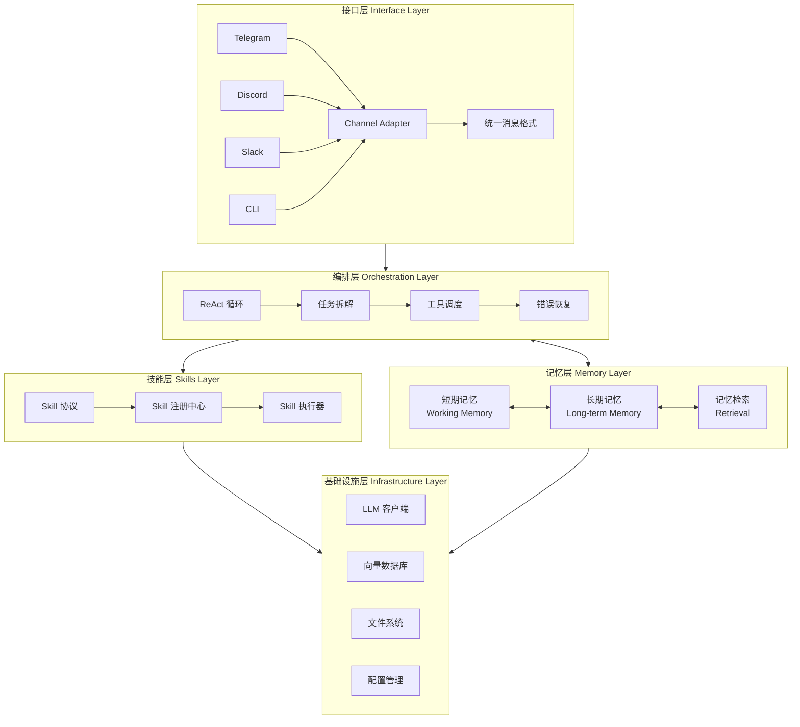
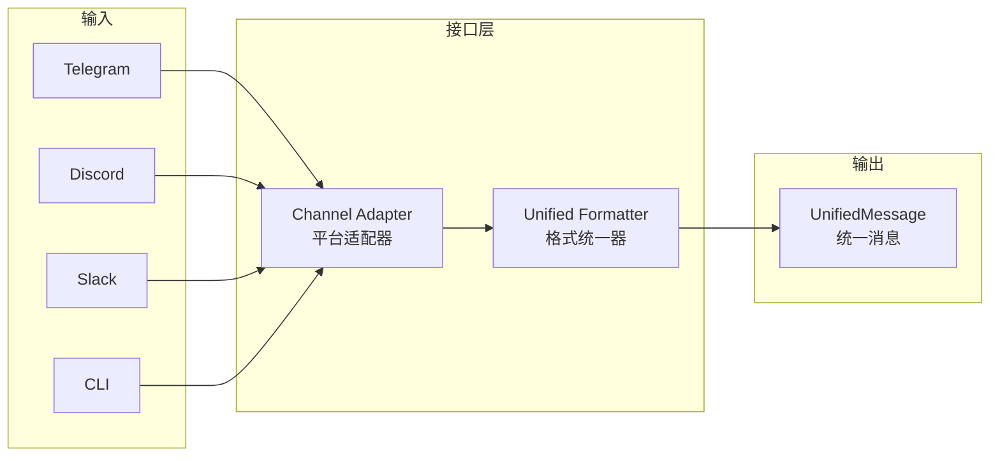
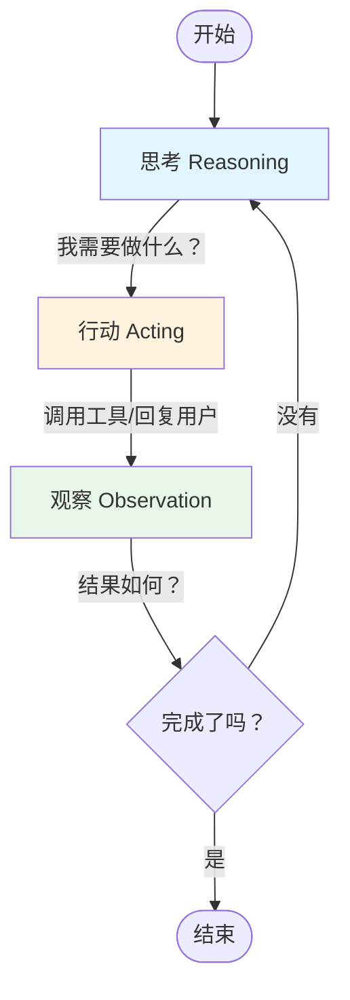
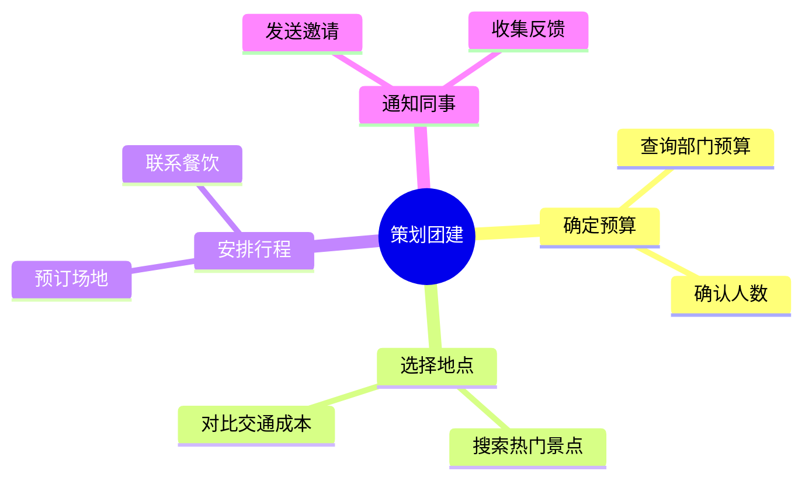
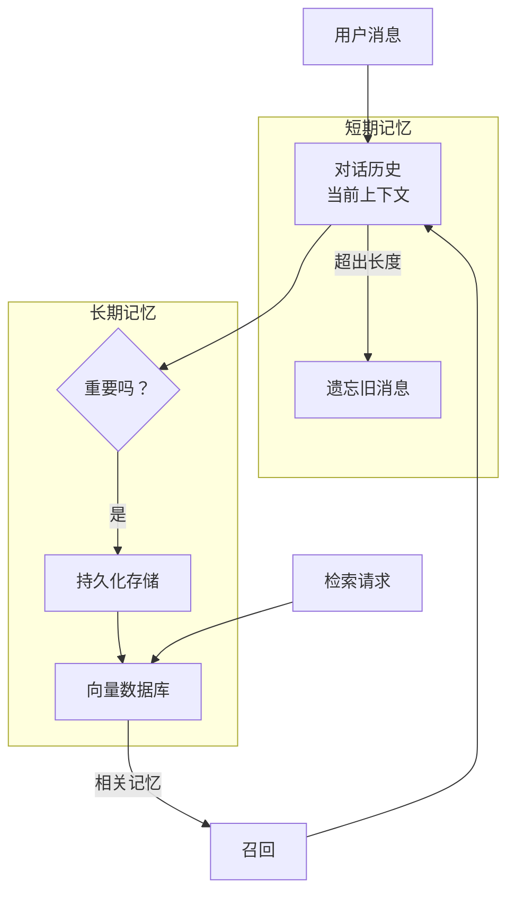
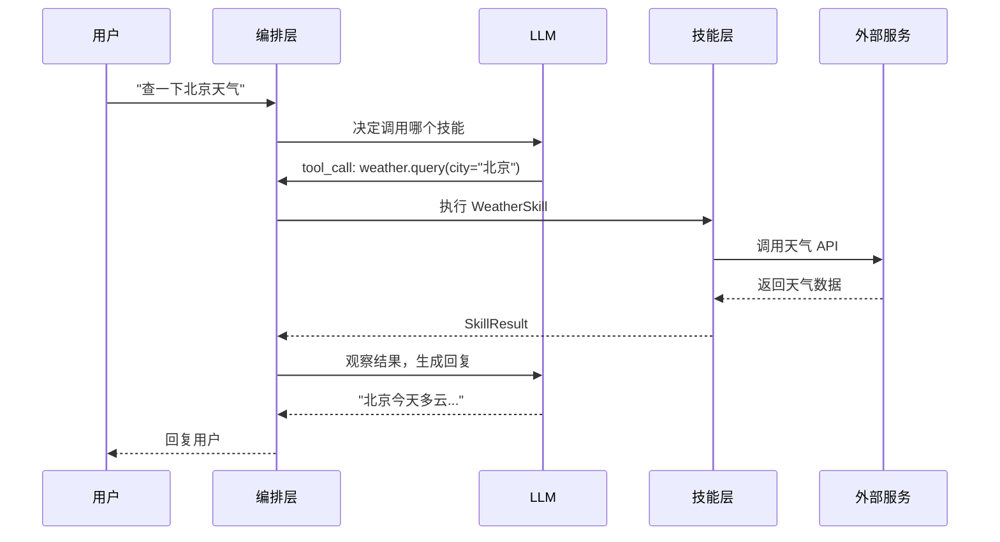
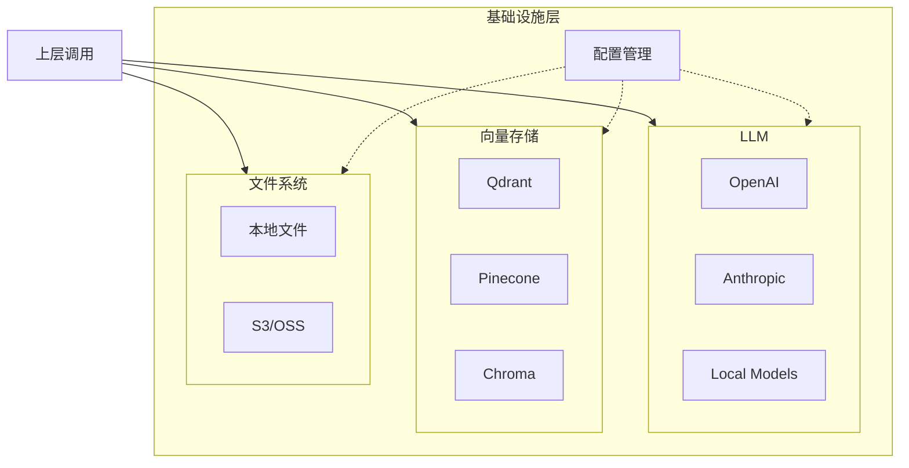
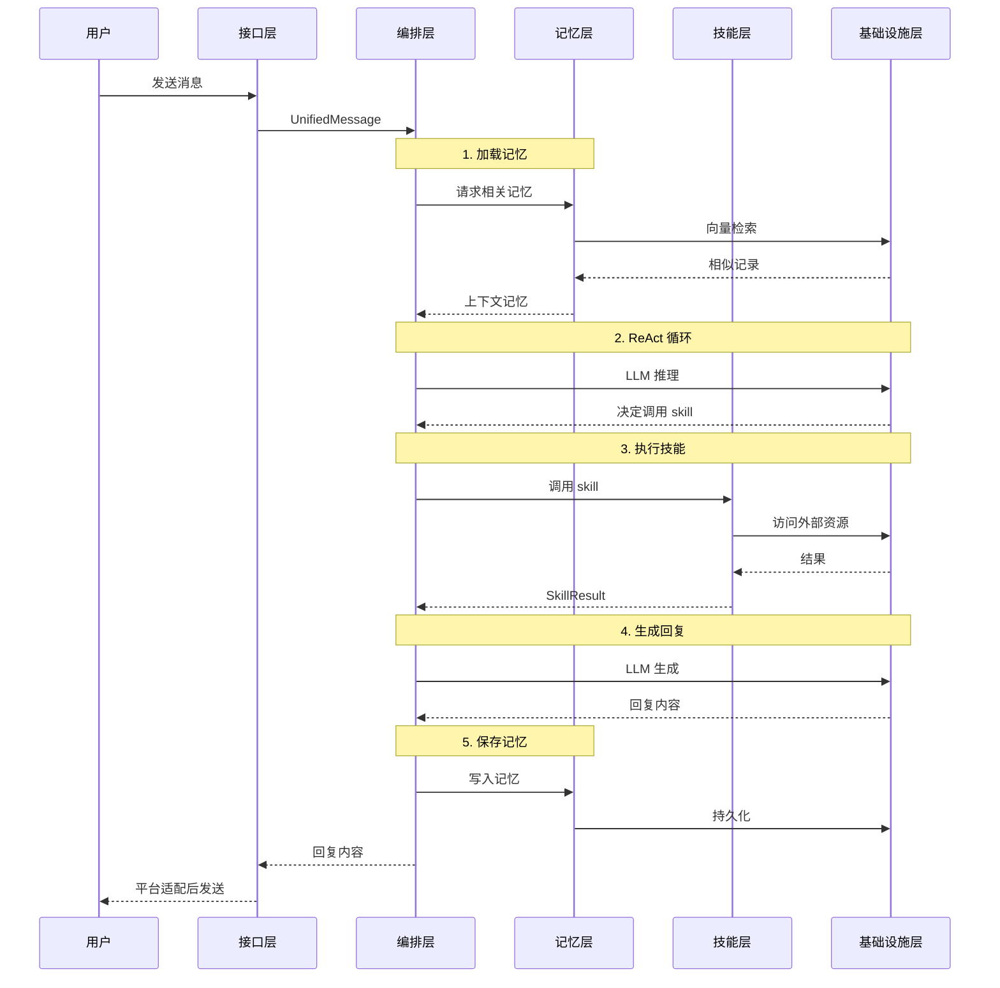
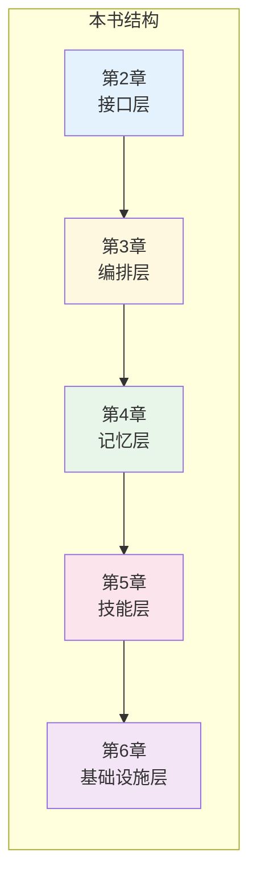
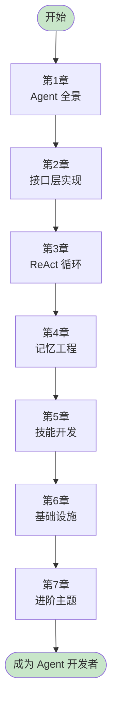

# 1.9 MiniClaw 五层架构全景图

> "好的架构让复杂变简单，坏的架构让简单变复杂。"

走到这里，第一章就要结束了。

这一章我们聊了很多——OpenClaw 的现象级爆发、Agent 的范式转变、真实世界的应用场景、为什么要自己造轮子。但有个问题一直没正面回答：

**MiniClaw 到底长什么样？**

这一节，我们把整本书的"地图"摊开。接下来所有章节，都会在这张地图上找到位置。

## 1.9.1 为什么要分层？

写 Agent 和写普通软件不太一样。

普通软件的流程是确定的：用户点按钮 → 调接口 → 返回结果。你清楚每一步该干什么。

Agent 不一样。用户说"帮我订一张明天去上海的机票"，Agent 要自己琢磨：

- 明天是几号？
- 用户从哪里出发？
- 偏好哪家航空公司？
- 要不要买保险？
- 支付怎么处理？

每一步都可能分支，每一步都可能出错，每一步都可能需要跟用户确认。

**这种复杂性，需要用架构来驾驭。**

分层架构的本质，是把大问题拆成小问题：

- 有人负责"听懂"用户在说什么
- 有人负责"想清楚"该干什么
- 有人负责"记住"之前发生的事
- 有人负责"干活"
- 有人负责提供"工具和资源"

每一层只管自己的事，别越界。这样出了问题，你知道去哪里找；要加新功能，你知道往哪里放。

MiniClaw 分成五层，不是随意决定的——每一层都对应一个清晰的职责边界。

## 1.9.2 五层架构全景图

先看全貌：



从上往下，依次是：

| 层级 | 名称 | 一句话职责 |
|------|------|-----------|
| 第一层 | 接口层 | 把外部消息翻译成 Agent 能听懂的格式 |
| 第二层 | 编排层 | 想清楚该干什么，按什么顺序干 |
| 第三层 | 记忆层 | 记住发生过的事，该用的时候能想起来 |
| 第四层 | 技能层 | 提供具体能力，干活的地方 |
| 第五层 | 基础设施层 | 提供底层支撑：模型、存储、配置 |

为什么是五层，不是三层或七层？

三层太粗，挤在一起的东西太多，边界模糊。七层太细，每一层都薄得没必要，增加了理解成本。五层是一个平衡点——每层都有足够的"肉"，又不会过于臃肿。

接下来，我们一层一层拆开看。

## 1.9.3 接口层：多平台消息接入

接口层是 Agent 的"耳朵"和"嘴巴"。

用户可能从 Telegram 跟你说话，可能在 Slack 发指令，可能在命令行敲代码。每种平台的消息格式都不一样：

```python
# Telegram 的消息长这样
{
    "message_id": 123,
    "from": {"id": 456, "username": "alice"},
    "text": "帮我查一下天气"
}

# Slack 的消息长这样
{
    "type": "message",
    "user": "U123456",
    "text": "帮我查一下天气",
    "channel": "C789012"
}

# Discord 的消息又不一样
{
    "id": "999999",
    "author": {"id": "111", "username": "bob"},
    "content": "帮我查一下天气",
    "channel_id": "222"
}
```

接口层的工作，就是把这些五花八门的消息，翻译成统一的内部格式：

```python
@dataclass
class UnifiedMessage:
    """统一消息格式"""
    message_id: str        # 消息唯一标识
    user_id: str          # 用户标识
    channel_id: str       # 频道/会话标识
    content: str          # 消息内容
    platform: str         # 来源平台
    timestamp: datetime   # 时间戳
    metadata: dict        # 平台特有信息
```

这样，上面的编排层就不用管消息是从哪来的——反正拿到的都是 `UnifiedMessage`。



接口层还要处理回复。Agent 生成的内容要发回去，不同平台要求不一样——有的支持 Markdown，有的不支持；有的可以发图片，有的只能发文字。接口层负责把 Agent 的输出"翻译"成平台能接受的格式。

## 1.9.4 编排层：ReAct 循环与任务拆解

编排层是 Agent 的"大脑"。

拿到用户的请求后，这里要回答一个问题：**接下来该干什么？**

### ReAct 循环

MiniClaw 的核心决策机制是 ReAct（Reasoning + Acting）循环：



每一步的意思：

1. **思考（Reasoning）**：LLM 分析当前状态，决定下一步
2. **行动（Acting）**：执行工具调用，或回复用户
3. **观察（Observation）**：获取行动结果，更新状态
4. **循环**：如果没完成，回到思考

举个具体例子。用户说"帮我查一下北京的天气，如果下雨就提醒我带伞"：

```
第1轮 - 思考：
用户想查北京天气，然后根据结果决定是否提醒。
我需要先调用天气工具。

第1轮 - 行动：
Tool: weather.query
Args: {city: "北京"}

第1轮 - 观察：
Result: 北京今天多云，降水概率10%

第2轮 - 思考：
降水概率很低，不需要提醒带伞。
可以直接回复用户了。

第2轮 - 行动：
Reply: 北京今天多云，降水概率只有10%，不用带伞~

第2轮 - 观察：
消息已发送

完成！
```

### 任务拆解

复杂任务需要拆解。用户说"帮我策划一次团建活动"，这不是一个工具调用能搞定的事。

编排层会把大任务拆成小任务：



每个子任务可能又需要多个工具调用。编排层负责调度这些子任务，确保它们按正确的顺序执行，处理中间的依赖关系。

### 错误恢复

事情不会总是顺利。工具可能调用失败，API 可能超时，用户可能中途改变主意。

编排层要处理这些情况：

- **重试**：临时失败，等一下再试
- **降级**：主要方案不行，换备选方案
- **询问**：实在搞不定，问用户怎么办
- **回滚**：部分完成了，要不要撤销

## 1.9.5 记忆层：短期与长期记忆

记忆层是 Agent 的"记性"。

没有记忆的 Agent，每次对话都从零开始。你刚说过的话，它转头就忘。这种体验，没法用。

记忆分成两种：

### 短期记忆（Working Memory）

短期记忆保存**当前对话**的上下文。

```python
class WorkingMemory:
    """短期记忆 - 当前会话"""
    
    def __init__(self):
        self.messages: List[Message] = []  # 对话历史
        self.context: Dict = {}            # 临时变量
        self.max_tokens: int = 4000        # 容量限制
```

特点：

- **容量有限**：LLM 有上下文长度限制，不能无限塞
- **即时更新**：每条消息都会写入
- **会话隔离**：不同会话的记忆不共享

短期记忆是 Agent 能"接住话茬"的基础。

### 长期记忆（Long-term Memory）

长期记忆保存**跨会话**的信息。

```python
class LongTermMemory:
    """长期记忆 - 跨会话持久化"""
    
    def __init__(self, vector_store):
        self.store = vector_store  # 向量数据库
        
    async def remember(self, content: str, metadata: dict):
        """记住一件事"""
        embedding = await self.embed(content)
        self.store.add(embedding, content, metadata)
        
    async def recall(self, query: str, top_k: int = 5):
        """回忆相关的事"""
        embedding = await self.embed(query)
        return self.store.search(embedding, top_k)
```

特点：

- **容量大**：可以存很多很多
- **检索式**：不是顺序读，是按相关性找
- **跨会话**：你去年说过的话，今年还能记得

长期记忆是 Agent 有"连贯人格"的基础。



### 记忆检索

长期记忆存了再多，找不出来也没用。

检索的核心是**语义相似度**——不是关键词匹配，而是理解你要找什么。

用户说"我们上次聊过的那个餐厅"，Agent 不会傻傻地搜"餐厅"两个字，而是把整句话转成向量，在记忆库里找语义最接近的记录。

这部分涉及向量化、索引、相似度计算——都是第4章的内容。

## 1.9.6 技能层：Skill 协议

技能层是 Agent 的"工具箱"。

光有脑子不行，还得有手有脚。技能层提供 Agent 调用外部工具、执行具体任务的能力。

### Skill 协议

每个技能都遵循统一的协议：

```python
class Skill(Protocol):
    """技能协议 - 所有 Skill 必须实现"""
    
    @property
    def name(self) -> str:
        """技能名称，如 'weather.query'"""
        ...
    
    @property
    def description(self) -> str:
        """技能描述，LLM 用它来理解这个技能是干嘛的"""
        ...
    
    @property
    def parameters(self) -> dict:
        """参数 schema，描述需要什么参数"""
        ...
    
    async def execute(self, **kwargs) -> SkillResult:
        """执行技能，返回结果"""
        ...
```

统一的协议意味着：

- **可发现**：LLM 能根据描述自动选择合适的技能
- **可组合**：多个技能可以串联执行
- **可扩展**：新技能只要遵循协议，就能被自动识别

### 技能注册

Agent 启动时，会扫描所有可用的技能，注册到技能中心：

```python
# 技能注册示例
skill_registry.register(WeatherSkill())
skill_registry.register(CalendarSkill())
skill_registry.register(EmailSkill())
skill_registry.register(CodeExecutionSkill())
```

LLM 通过技能列表知道"我能干什么"：

```json
[
  {
    "name": "weather.query",
    "description": "查询指定城市的天气信息",
    "parameters": {
      "city": {"type": "string", "description": "城市名称"}
    }
  },
  {
    "name": "calendar.create_event",
    "description": "创建日历事件",
    "parameters": {
      "title": {"type": "string"},
      "time": {"type": "string"},
      "attendees": {"type": "array", "items": {"type": "string"}}
    }
  }
]
```

### 技能执行

LLM 决定调用某个技能后，编排层负责执行：



技能层是 Agent 和外部世界交互的桥梁——查天气、发邮件、写代码、操作数据库，都在这里。

## 1.9.7 基础设施层：底层支撑

基础设施层是 Agent 的"地基"。

上面四层都依赖这一层提供的底层能力：

### LLM 客户端

大语言模型是 Agent 的核心引擎。这一层封装了和不同 LLM 的交互：

```python
class LLMClient:
    """LLM 客户端 - 统一不同模型的调用方式"""
    
    def __init__(self, provider: str, model: str):
        self.provider = provider  # openai, anthropic, local
        self.model = model        # gpt-4, claude-3, etc.
    
    async def complete(self, messages: List[Message]) -> str:
        """生成回复"""
        ...
    
    async def embed(self, text: str) -> List[float]:
        """生成向量"""
        ...
```

不管是 OpenAI、Anthropic 还是本地模型，上层代码只需要调用 `complete()` 和 `embed()`，不用关心底层差异。

### 向量数据库

长期记忆的存储依赖向量数据库：

```python
class VectorStore(Protocol):
    """向量数据库协议"""
    
    async def add(self, id: str, embedding: List[float], 
                  metadata: dict) -> None:
        """添加向量"""
        ...
    
    async def search(self, query: List[float], 
                     top_k: int) -> List[SearchResult]:
        """相似度搜索"""
        ...
    
    async def delete(self, id: str) -> None:
        """删除向量"""
        ...
```

可以用 Qdrant、Pinecone、Chroma，只要实现这个协议就行。

### 文件系统

Agent 需要读写文件：

- 用户上传的图片、文档
- 生成的代码、报告
- 日志、配置文件

这一层提供统一的文件访问接口，屏蔽本地文件系统和云存储的差异。

### 配置管理

```yaml
# config.yaml
llm:
  provider: openai
  model: gpt-4
  
memory:
  working_max_tokens: 4000
  long_term_provider: qdrant
  
skills:
  enabled:
    - weather
    - calendar
    - email
  disabled:
    - code_execution  # 生产环境禁用
```

所有配置集中管理，方便部署和调试。



## 1.9.8 层间协作：数据流全景

五层不是孤立的，它们需要协作。

看一个完整请求的数据流：



核心要点：

1. **接口层**只管消息的进出，不参与决策
2. **编排层**是中枢，协调其他所有层
3. **记忆层**是被动服务，有请求才响应
4. **技能层**只管干活，不关心上下文
5. **基础设施层**提供资源，不关心业务逻辑

每一层都只做自己分内的事，通过清晰的接口与其他层交互。

## 1.9.9 全书导航：章节与架构对应

这张五层架构图，其实就是整本书的目录。

| 章节 | 对应层级 | 核心内容 |
|------|----------|----------|
| 第2章 | 接口层 | Channel 协议、多平台适配 |
| 第3章 | 编排层 | ReAct 循环、任务规划 |
| 第4章 | 记忆层 | 短期/长期记忆、RAG |
| 第5章 | 技能层 | Skill 协议、工具开发 |
| 第6章 | 基础设施层 | LLM 集成、向量库、部署 |



### 学习路线图



每一章都在这五层架构中找到位置。学完第2章，你就能写出接收多平台消息的 Agent；学完第3章，你的 Agent 就能思考、规划、执行；学完第4章，它就能记住你们的所有对话……

一步一步，从零到一个完整的 Agent 框架。

## 1.9.10 架构哲学：为什么这样设计？

最后聊聊设计决策背后的考量。

### 极简原则

MiniClaw 的核心代码不到 3000 行。对比一下：

| 框架 | 核心代码量 |
|------|-----------|
| LangChain | 100,000+ 行 |
| AutoGPT | 30,000+ 行 |
| MiniClaw | ~3,000 行 |

为什么这么少？因为我们删掉了所有"可能有用的东西"，只保留"必须有"的核心。

**少即是多。** 代码越少，Bug 越少；抽象越少，调试越容易；依赖越少，部署越简单。

### 关注点分离

每一层只管一件事：

- 接口层不关心业务逻辑
- 编排层不关心消息从哪来
- 记忆层不关心记忆怎么用
- 技能层不关心任务规划
- 基础设施层不关心业务语义

这种分离让系统变得**可理解**。出了问题，你不用在大海捞针，而是去对应的层找。

### 可扩展性

想加新平台？写个 Channel Adapter，实现三个方法就行。

想加新技能？写个 Skill 类，实现四个方法就行。

想换 LLM？改一行配置就行。

扩展不需要改动核心代码，只需要在边界上添加新模块。这是开闭原则的实践。

### 为学习而设计

MiniClaw 不是生产框架，是教学框架。

生产框架追求功能完整、性能极致。教学框架追求清晰易懂、一目了然。

我们选择了后者。如果你读完这本书，能理解每一行代码为什么存在，我们的目的就达到了。

---

第一章，到这里就结束了。

我们聊了 OpenClaw 的爆火、聊了 Agent 的前世今生、聊了为什么要自己造轮子。现在，你手里有了这张五层架构图。

接下来，该动手了。

下一章，我们从第一层开始——接口层。你会亲手写出第一个能接收消息的 Agent。

**准备好，开干。**

---

[下一章：第2章 - 接口层 →](../chapter-02)
