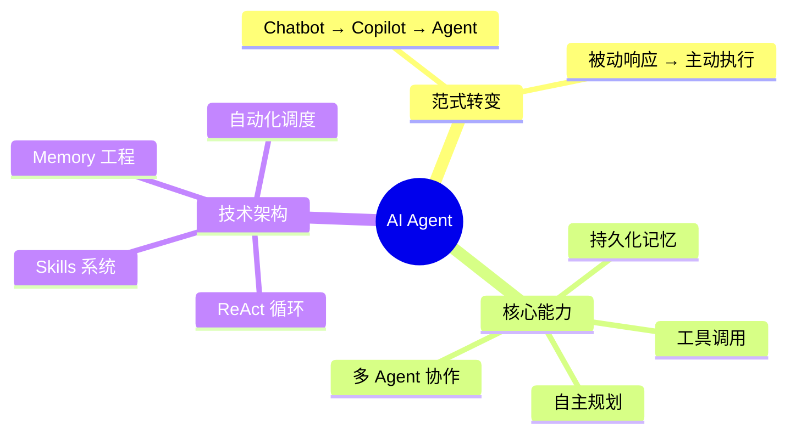

# 第1章 - AI Agent 全景：从概念到现象

:::info 预估时长
180 分钟
:::

:::tip 本章目标
理解 AI Agent 的本质、OpenClaw 现象背后的意义、以及为什么要学习 Agent 架构。
:::

## 本章概览

2026年1月，OpenClaw 在 GitHub 上创造了历史——2天10万 Star，一周15万+。这不仅是一个开源项目的成功，更是 AI 从"对话工具"到"行动助手"范式转变的标志性事件。

本章将带你深入理解：
- OpenClaw 为什么能引爆全球？
- Moltbook（120万 AI Agent 社交网络）揭示了什么？
- AI Agent 的三次范式转变是什么？
- 我们为什么要从零手写一个 Agent 框架？

---

## 章节目录

- [1.1 OpenClaw 现象：2天10万Star的秘密](./01-openclaw-phenomenon)
- [1.2 Moltbook 实验：120万 AI Agent 的社交网络](./02-moltbook-experiment)
- [1.3 从对话到行动：Agent 的三次范式转变](./03-paradigm-shift)
- [1.4 Agent 能做什么？真实案例](./04-real-cases)
- [1.5 Multi-Agent 协作：一群 Agent > 一个超级 Agent](./05-multi-agent)
- [1.6 AI Agent 简史：从 ELIZA 到 OpenClaw](./06-history)
- [1.7 Agent 生态全景](./07-ecosystem)
- [1.8 手写框架 vs LangChain：为什么要重造轮子？](./08-why-build)
- [1.9 MiniClaw 五层架构全景图](./09-architecture)

---

## 核心要点

---

[下一节：OpenClaw 现象 →](./01-openclaw-phenomenon)
