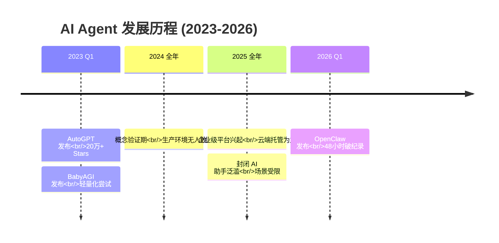
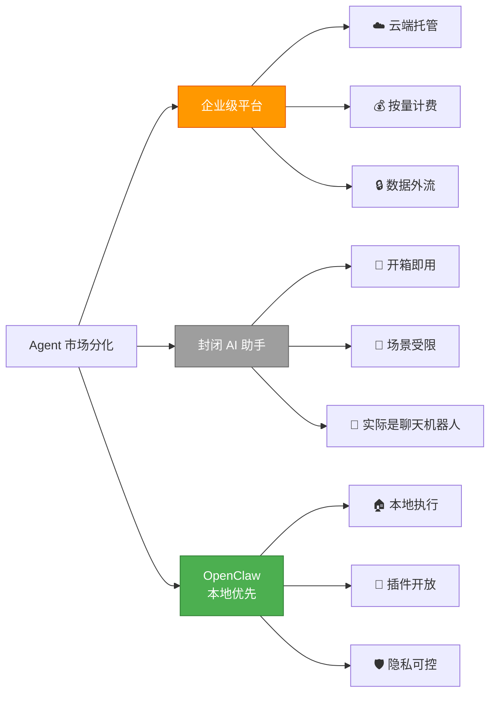
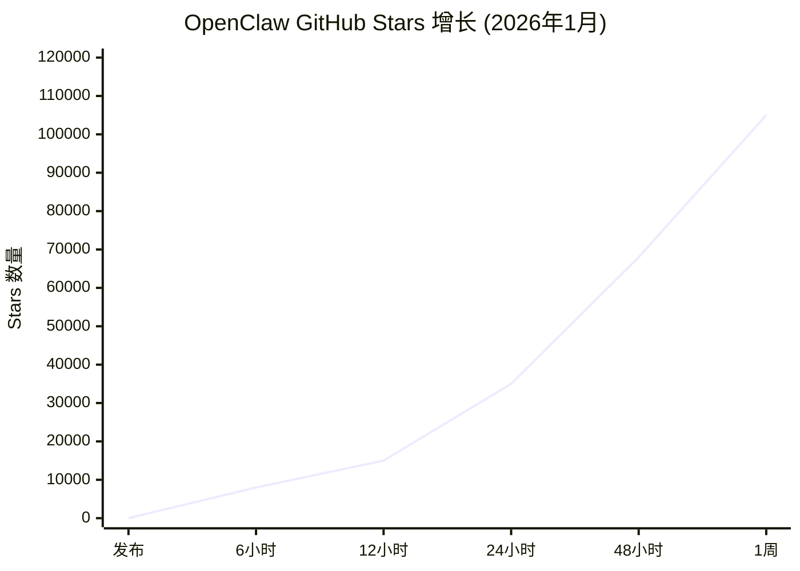
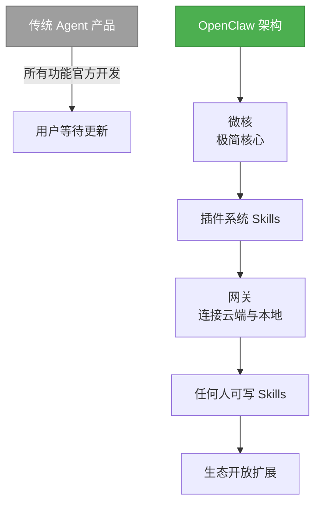
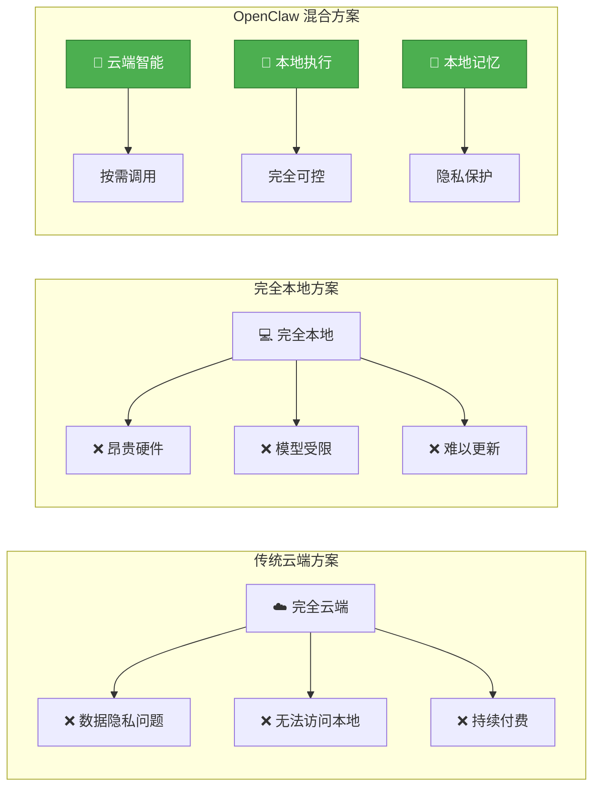
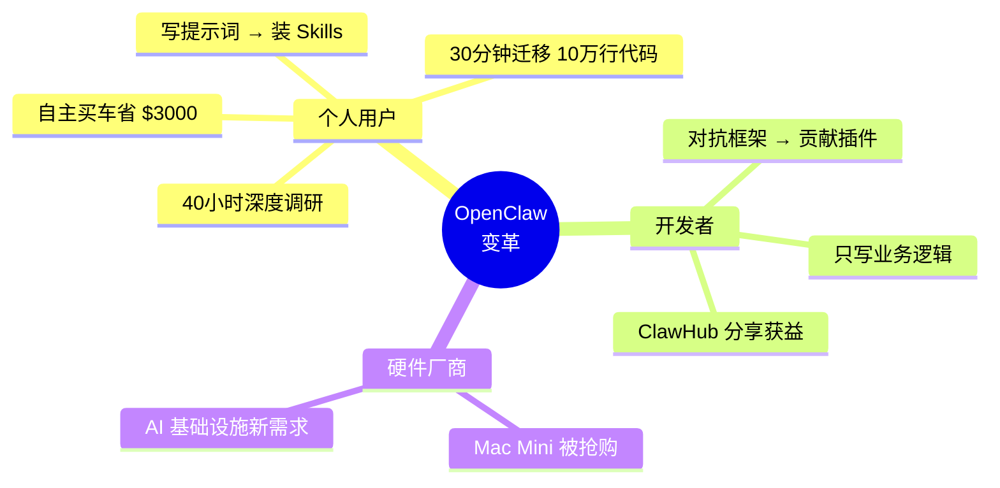

# OpenClaw 现象：从"玩具"到"工具"的跨越

2026年1月，一个开源项目在48小时内改写了 AI Agent 的历史。

但这不是故事的开始。

## 要理解 OpenClaw，先理解它打破了什么

在它之前，AI Agent 领域已经折腾了三年。



**AutoGPT（2023年3月）** 掀起了第一波 Agent 热潮。它的想法很简单：让 AI 不只是回答问题，而是自己拆解任务、规划步骤、循环执行。

```
目标：帮我调研竞品
AutoGPT 的思路：
  1. 搜索竞品名单
  2. 访问每个官网
  3. 提取关键信息
  4. 汇总成报告
  5. 如果信息不足，重新搜索
```

当时看起来很厉害。

但开发者很快发现问题了。

| 问题 | 具体表现 |
|------|---------|
| **成本失控** | 一个简单任务可能消耗 $10+ API 费用，因为它会在某个步骤死循环 |
| **不可靠** | 10次运行可能有5种不同结果 |
| **无法调试** | 出问题不知道卡在哪里 |
| **严重警告** | 官方 README 的警告比药瓶还多 |

**BabyAGI（2023年3月）** 换了个思路：更轻量、更可控。强调任务优先级的动态管理，而不是全自主执行。

结果一样，生产环境没人敢用。

这两个项目加起来获得了超过 20 万 GitHub Stars。这说明需求真实存在。但它们都停留在"实验性"阶段。

### 2024：从概念到产品的阵痛

AutoGPT 和 BabyAGI 证明了方向，但没人能把它们变成真正可用的产品。

原因很现实：

| 问题 | 为什么难解决 |
|------|-------------|
| **成本失控** | 一个任务可能循环调用 API 几十次 |
| **结果随机** | 同样指令，每次执行路径都不同 |
| **无法调试** | 出问题时不知道卡在哪一步 |
| **部署门槛** | 普通用户搞不定 Python 环境、API Key 配置 |

不可预测意味着无法在生产环境使用。

于是行业分成了两派。

### 2025：两条产品路线的分化



**路线1：企业级 Agent 平台**
- 典型代表：OpenAI Operator、Microsoft Copilot Agents
- 特点：云端托管、能力强大、按量计费
- 问题：
  - 数据离开本地
  - 成本随使用累积
  - 功能受平台限制

**路线2：封闭的 AI 助手**
- 典型代表：各种 "AI 助手" App
- 特点：开箱即用、场景受限
- 问题：
  - 只能做预设的功能
  - 无法访问你的文件和工具
  - 实际上是"披着 Agent 外衣的聊天机器人"

**缺了什么？**

一个个人完全掌控、本地执行、真正开放的 Agent。

不是云端租用。不是封闭系统。是你自己的 AI 代理。

## OpenClaw 的破局：三个关键决策

Peter Steinberger 一个人在一周内提交了 6,600 次 commits。



**48 小时内**，OpenClaw 获得了接近 7 万 Stars，打破了所有 Agent 项目的历史记录。这不是营销炒作，是真实需求被压抑三年的爆发。

### 决策1：微核+插件架构



传统 Agent 产品的问题是：所有功能都由官方开发，用户只能等待。

OpenClaw 选了另一条路：

```
微核（极简核心）
  ↓
插件系统（Skills）
  ↓
网关（连接云端大脑与本地肉身）
```

这个架构带来两个好处：

1. 核心稳定：微核只负责最基础的消息路由和生命周期管理
2. 生态开放：任何人都可以写 Skills，扩展能力不再依赖官方

**对比**：
| 产品 | 想要新功能怎么办 |
|------|-----------------|
| OpenAI Operator | 等官方更新 |
| 各种 AI 助手 App | 只能用预设功能 |
| OpenClaw | 自己写或从 ClawHub 安装 |

这就是为什么 OpenClaw 发布后，48小时内就出现了各种第三方 Skills。能力扩展不再被垄断。

### 决策2：本地优先，云端大脑



OpenClaw 的架构是大脑在云端，肉身在本地：

- **云端**：调用各种 LLM API（OpenAI、Anthropic、智谱等）
- **本地**：执行文件操作、系统命令、浏览器控制

这个设计解决了 Agent 的核心悖论：

```
如果 Agent 完全在云端：
  → 数据隐私问题
  → 无法访问本地资源
  → 持续付费成本

如果 Agent 完全在本地：
  → 需要昂贵的硬件
  → 模型能力受限
  → 难以获得最新能力

OpenClaw 的方案：
  → 云端提供智能（按需调用）
  → 本地提供执行（完全可控）
  → 本地存储记忆（隐私保护）
```

### 决策3：多平台消息接口

这是最被低估的创新。

传统 Agent 要么在命令行里用，要么在某个特定的 App 里。OpenClaw 直接对接了 WhatsApp、Telegram、Signal、Discord 等主流聊天平台。

这意味着什么？

- 用户不需要下载新 App
- 可以在任何设备上使用（手机、电脑、平板）
- 通知机制天然存在
- 使用习惯无需改变

这不是技术难度的问题，是产品思维的降维打击。

## 为什么是 2026 年 1 月

技术条件、市场需求、时机，三者在这一点汇聚。

### 技术条件成熟

- 模型能力：Claude Opus 4、GLM-5 等模型在 Agent 场景的可靠性大幅提升
- 推理成本：比 2023 年下降了 10-100 倍
- 开源生态：各种小模型可以在本地处理简单任务

### 痛点积累到临界点

- 早期的 AutoGPT 用户经历了三年的失望
- 企业 Agent 平台太贵太复杂
- 云端 Agent 服务让人们开始担心隐私
- 开发者厌倦了为 20% 的定制需求对抗框架

### 一人独裁开发的效率

Peter Steinberger 的 "I ship code I don't read" 听起来疯狂，但背后是 AI 辅助开发的真实场景：

- 他用 AI 生成 90% 的代码
- 自己只做架构决策和最终审核
- 一周 6,600 commits，相当于传统团队的季度产出

这不是炫耀。是 AI 时代开发模式的证明。

## OpenClaw 带来了什么变革



### 对个人用户

**从"写提示词"到"装 Skills"**

过去：想要让 AI 做事，你必须写出完美的提示词，还要反复调试。
现在：安装别人写好的 Skill，AI 按照标准流程执行，准确率可控。

**真实案例**：
- 自主买车，对比十几家经销商，省下 $3,000
- 30分钟迁移 10万行 Python 2 代码到 Python 3
- 40小时深度调研，自主阅读总结 50+ 篇论文

这些在 AutoGPT 时代会失败的任务，在 OpenClaw 上可以稳定完成。原因不是模型更强，是工作流更可控。

### 对开发者

**从"对抗框架"到"贡献插件"**

- 不需要理解整个框架的代码
- 只需要写好一个 Skill 的业务逻辑
- 可以分享到 ClawHub 获得收益

### 对硬件厂商

Mac Mini 从"便宜的 Mac"跃升为"AI 基础设施"，被抢购一空。

这不是营销成功。是需求被验证：个人确实愿意为本地 Agent 买单。

## 但这不是童话

OpenClaw 的火爆也暴露了问题。

### 安全争议

OpenClaw 给了 Agent 系统级权限：文件操作、命令执行、浏览器控制。

这带来了真实的攻击面：
- 私有数据 + 不可信内容 + 外部通信能力 = 数据泄露风险
- Agent 的自主性意味着它可能执行非预期的操作

安全社区的警告不是杞人忧天。

### 质量参差不齐

Skills 市场开放后，质量差异巨大。一个 buggy 的 Skill 可能导致整个 Agent 异常。

### 生态碎片化

没有统一的 Skill 质量标准，没有兼容性保证，生态可能走向混乱。

## 这只是开始

OpenClaw 的意义不在于它本身多么完美，而在于：

1. 验证了个人 Agent 的市场需求 - 10万+ Stars 不是炒出来的
2. 证明了 AI 辅助开发的效率 - 一人独裁可以跑赢团队
3. 建立了开放生态的范式 - Skills 市场比封闭平台更有生命力

它不是终点。是新范式的起点。

真正的变革才刚刚开始。

---

**延伸阅读**：
- [Agent 发展简史](/appendix/agent-history) - 从 ELIZA 到 OpenClaw
- [OpenClaw 架构解析](/chapters/chapter-02/openclaw-architecture) - 技术实现细节
- [安全实践指南](/appendix/security) - 如何安全地使用 Agent
