# 3.2 Docker Compose 编排基础设施

> 本节我们将使用 Docker Compose 编排 PostgreSQL 数据库和 pgvector 扩展。

## 📋 本节目标

- 理解 Docker Compose 的作用
- 配置 PostgreSQL 数据库
- 安装 pgvector 扩展（向量检索支持）
- 启动并验证数据库服务

## 🎯 本节要点

**为什么需要这一节？**

MiniClaw 需要一个数据库来存储：
- **会话数据**：用户与 Agent 的对话记录
- **向量数据**：AI 生成的语义向量（用于 Memory 系统）

而 Docker Compose 帮我们快速搭建这个数据库环境，无需手动安装 PostgreSQL。

**核心概念：**

1. **Docker**：容器化技术，把 PostgreSQL 打包成一个"容器"，在任何系统上都能运行
2. **Docker Compose**：用配置文件定义容器，一键启动/停止
3. **pgvector**：PostgreSQL 扩展，支持向量存储和相似度检索
4. **数据持久化**：容器删除后数据不丢失（通过 Volume）

**本节完成后，你会得到：**

- ✅ 一个运行中的 PostgreSQL 数据库（端口 5432）
- ✅ 已安装 pgvector 扩展（向量检索能力）
- ✅ 数据持久化配置（重启不丢数据）

## 🐳 Docker 做了什么？

### 传统方式 vs Docker 方式

**传统方式（手动安装 PostgreSQL）：**

```
1. 下载 PostgreSQL 安装包
2. 安装到操作系统
3. 配置环境变量
4. 创建数据库用户
5. 安装 pgvector 扩展（需要编译）
6. 配置开机自启
...
```

**Docker 方式（本节使用）：**

```
1. 编写 docker-compose.yml（配置文件）
2. docker-compose up -d（一条命令启动）
✅ 完成！
```

### Docker 的工作流程

```mermaid
graph LR
    A[编写 docker-compose.yml] --> B[docker-compose up -d]
    B --> C[Docker 下载镜像]
    C --> D[创建容器]
    D --> E[执行 init.sql]
    E --> F[PostgreSQL 启动完成]
    F --> G[应用连接数据库]
```



**关键步骤：**

1. **下载镜像**：Docker 从 Docker Hub 下载 `pgvector/pgvector:pg16` 镜像（已包含 PostgreSQL 16 + pgvector）
2. **创建容器**：根据配置创建一个独立的容器环境
3. **执行初始化脚本**：自动运行 `init.sql`，安装扩展
4. **启动数据库**：PostgreSQL 在容器内启动
5. **映射端口**：容器的 5432 端口映射到宿主机，应用可以通过 `localhost:5432` 连接

### 数据持久化原理

```
┌─────────────────┐
│  Docker 容器     │
│                 │
│  PostgreSQL     │
│     ↓           │
│  /var/lib/...   │
│     ↓           │
└─────────────────┘
         ↓
    Volume 挂载
         ↓
┌─────────────────┐
│  宿主机磁盘      │
│  postgres_data  │
│  （持久化存储）   │
└─────────────────┘
```

**关键点：**
- 容器内的数据存储在 `/var/lib/postgresql/data`
- 这个目录挂载到宿主机的 Volume `postgres_data`
- 即使删除容器，Volume 中的数据依然存在
- 下次启动新容器，会自动挂载这个 Volume，数据恢复

## 📦 文件结构

本节创建的文件：

```
miniclaw-learn/
├── docker-compose.yml           # Docker Compose 配置
│                                 # 定义了 PostgreSQL 容器的配置
└── docker/
    └── postgres/
        └── init.sql             # 数据库初始化脚本
                                  # 容器启动时自动执行
```

## 📄 配置文件解析

### docker-compose.yml

```yaml
version: '3.8'

services:
  postgres:
    image: pgvector/pgvector:pg16
    container_name: miniclaw-learn-postgres
    environment:
      POSTGRES_USER: miniclaw
      POSTGRES_PASSWORD: miniclaw123
      POSTGRES_DB: miniclaw
    ports:
      - "5432:5432"
    volumes:
      - postgres_data:/var/lib/postgresql/data
      - ./docker/postgres/init.sql:/docker-entrypoint-initdb.d/init.sql:ro
    healthcheck:
      test: ["CMD-SHELL", "pg_isready -U miniclaw -d miniclaw"]
      interval: 10s
      timeout: 5s
      retries: 5
    restart: unless-stopped

volumes:
  postgres_data:
    driver: local
```

**关键配置说明：**

| 配置项 | 说明 | 注意事项 |
|--------|------|----------|
| `image: pgvector/pgvector:pg16` | 使用 PostgreSQL 16 + pgvector 镜像 | 官方推荐版本 |
| `POSTGRES_PASSWORD` | 数据库密码 | 生产环境请使用强密码 |
| `volumes: postgres_data` | 数据持久化 | 删除容器不会丢失数据 |
| `healthcheck` | 健康检查 | 确保数据库已启动 |
| `restart: unless-stopped` | 自动重启 | 除非手动停止，否则自动重启 |

### init.sql

```sql
-- pgvector 扩展：用于向量检索（第 10 章 Memory 系统使用）
CREATE EXTENSION IF NOT EXISTS vector;

-- uuid-ossp 扩展：用于自动生成 UUID
CREATE EXTENSION IF NOT EXISTS "uuid-ossp";
```

**扩展说明：**

- **pgvector**：PostgreSQL 向量检索扩展，用于存储和查询向量数据（Memory 系统的语义检索）
- **uuid-ossp**：UUID 生成扩展，用于自动生成主键

## 🚀 启动数据库

### 1. 安装 Docker

**检查是否已安装：**

```bash
docker --version
docker-compose --version
```

**预期输出：**

```
Docker version 24.0.7
Docker Compose version v2.23.0
```

**安装方法：**

- **macOS**: 下载 [Docker Desktop](https://www.docker.com/products/docker-desktop/)
- **Ubuntu/Debian**: `sudo apt install docker.io docker-compose`
- **Windows**: 下载 [Docker Desktop](https://www.docker.com/products/docker-desktop/)

### 2. 启动服务

```bash
cd miniclaw-learn
docker-compose up -d
```

**预期输出：**

```
Creating network "miniclaw-learn_default" with the default driver
Creating volume "miniclaw-learn_postgres_data" with local driver
Pulling postgres (pgvector/pgvector:pg16)...
...
Creating miniclaw-learn-postgres ... done
```

### 3. 查看容器状态

```bash
docker-compose ps
```

**预期输出：**

```
NAME                      STATUS              PORTS
miniclaw-learn-postgres   Up 10 seconds       0.0.0.0:5432->5432/tcp
```

### 4. 查看日志

```bash
docker-compose logs postgres
```

**预期输出（最后几行）：**

```
PostgreSQL init process complete; ready for start up.
PostgreSQL extensions installed: vector, uuid-ossp
```

## ✅ 验证数据库

### 1. 连接数据库

```bash
# 使用 psql 客户端连接
psql -h localhost -U miniclaw -d miniclaw
```

**输入密码：** `miniclaw123`

### 2. 验证扩展

```sql
-- 查看已安装的扩展
\dx
```

**预期输出：**

```
                                      List of installed extensions
   Name    | Version |   Schema   |                     Description
-----------+---------+------------+------------------------------------------------------
 plpgsql   | 1.0     | pg_catalog | PL/pgSQL procedural language
 uuid-ossp | 1.1     | public     | generate universally unique identifiers (UUIDs)
 vector    | 0.5.0   | public     | vector data type and ivfflat and hnsw access methods
(3 rows)
```

### 3. 测试向量功能

```sql
-- 创建测试表
CREATE TABLE test_vectors (
    id serial PRIMARY KEY,
    embedding vector(3)
);

-- 插入测试数据
INSERT INTO test_vectors (embedding) VALUES ('[1,2,3]'), ('[4,5,6]');

-- 查询相似向量
SELECT * FROM test_vectors ORDER BY embedding <-> '[1,2,3]' LIMIT 5;

-- 清理测试数据
DROP TABLE test_vectors;

-- 退出
\q
```

## 🛠️ 常用命令

```bash
# 启动服务
docker-compose up -d

# 停止服务
docker-compose stop

# 停止并删除容器（保留数据）
docker-compose down

# 停止并删除容器和数据（危险！）
docker-compose down -v

# 查看日志
docker-compose logs -f postgres

# 重启服务
docker-compose restart

# 进入容器
docker-compose exec postgres bash
```

## 🐛 常见问题

### 1. 端口被占用

**问题：**

```
Error: port is already allocated
```

**解决方案：**

查看占用端口的进程：

```bash
# macOS/Linux
lsof -i :5432

# 停止占用端口的 PostgreSQL
sudo systemctl stop postgresql
```

或修改 `docker-compose.yml`：

```yaml
ports:
  - "5433:5432"  # 使用其他端口
```

### 2. 数据库密码错误

**问题：**

```
psql: error: connection to server on socket "/tmp/.s.PGSQL.5432" failed: FATAL:  password authentication failed
```

**解决方案：**

确认密码正确（`miniclaw123`），或重置数据库：

```bash
docker-compose down -v
docker-compose up -d
```

### 3. 容器启动失败

**问题：**

```
ERROR: for miniclaw-learn-postgres  Cannot start service postgres
```

**解决方案：**

查看详细日志：

```bash
docker-compose logs postgres
```

常见原因：
- Docker 未启动
- 磁盘空间不足
- 镜像下载失败

## 🎓 技术要点

### 为什么用 PostgreSQL 而不是 MySQL？

1. **pgvector 扩展**：PostgreSQL 有成熟的向量检索扩展
2. **JSON 支持**：PostgreSQL 的 JSONB 类型性能更好
3. **开源生态**：PostgreSQL 社区活跃，扩展丰富

### pgvector 的作用

- **向量存储**：存储 Embedding 向量（AI 生成的语义向量）
- **相似度检索**：根据向量相似度检索数据
- **Memory 系统**：第 10 章会用 pgvector 实现语义检索

### 为什么需要 uuid-ossp？

- **自动生成 UUID**：主键不需要手动赋值
- **分布式友好**：UUID 不会冲突
- **安全性**：UUID 不可预测

## 📚 扩展阅读

- [Docker Compose 官方文档](https://docs.docker.com/compose/)
- [PostgreSQL 官方文档](https://www.postgresql.org/docs/16/index.html)
- [pgvector 官方文档](https://github.com/pgvector/pgvector)

## 🎯 下一步

下一节我们将：
- 使用 Flyway 管理数据库版本
- 设计 Session/Run/Message 数据表
- 创建数据库迁移脚本

[下一节：3.3 Flyway 数据库迁移 →](./3.3-flyway.md)
